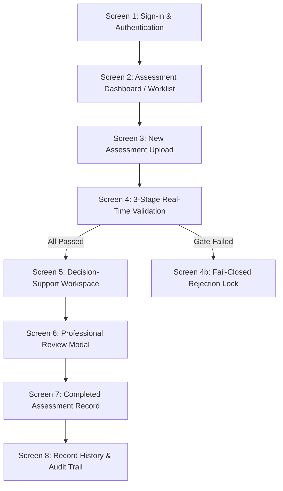

# Diabetic Retinopathy CDSS — Comprehensive Testing & Verification Runbook

**Research Project:** AI-Based Clinical Decision Support System for Early Detection of Diabetic Retinopathy  
**Researcher / PGD Candidate:** Onyekelu Chukwuebuka Elochukwu (2024516020FN)  
**Document Purpose:** Complete operational verification runbook covering automated test suites, mathematical thresholds, empirical classifier validation, and step-by-step clinical UI walkthrough for thesis defense.

---

## 1. System Pre-Flight Checklist

Before initiating test procedures, verify that the local environment satisfies all core dependencies:

```powershell
# 1. Verify Python and PyTorch CPU installation
python -c "import torch, torchvision; print('PyTorch:', torch.__version__, '| Torchvision:', torchvision.__version__)"
# Expected Output: PyTorch: 2.14.0+cpu | Torchvision: 0.29.0+cpu

# 2. Verify Node.js and npm
node -v; npm -v
# Expected Output: v20.x or v22.x+ / npm 10.x+

# 3. Verify PyTorch Checkpoint and SHA-256 Checksum
python -c "import hashlib; h = hashlib.sha256(open('backend/models/weights/efficientnet_b0_dr.pth', 'rb').read()).hexdigest(); print('Weights SHA-256:', h)"
# Expected Output: 67d0b89641f08057126dd411e380b25575ef29f71ae37ee5796d472d9203dbf7
```

---

## 2. Automated Test Execution

### 2.1 Complete Automated Backend Test Suite (38 Test Cases)
Run the entire regression, state machine, validation pipeline, and governance test suite:

```powershell
python -m pytest backend/tests/ -v
```

#### Expected Output:
```text
======================= 38 passed, 2 warnings in ~46s =======================
```

#### Key Automated Invariants Verified:
- **Gate 1 (File Integrity):** Validates magic bytes for authentic JPEG/PNG; strictly rejects zero-byte payloads, corrupt signatures, and files exceeding 15.0 MB.
- **Gate 2 (Retinal Field Relevance):** Enforces ophthalmic aperture aspect ratio ($0.65 - 1.65$), dark corner boundary check, and chromatic red/blue spectral ratio ($R/B > 1.15$). Rejects documents, portraits, and radiographs.
- **Gate 3 (Technical Image Quality):** Convolves discrete Laplacian operator ($3 \times 3$) to quantify blur variance ($\sigma_L^2 \ge 4.3$) and measures normalized luminance ($0.20 \le \bar{Y} \le 0.85$).
- **Fail-Closed Safety Invariant:** Failure at any gate permanently prohibits model tensor execution and locks the encounter in `rejected` status.
- **Clinician-in-the-Loop Governance:** AI model observations and professional review responses reside in distinct, decoupled database entities; a signed review is hash-sealed and write-locked (`is_immutable`).

---

## 3. Empirical Classifier & Model Evaluation Testing

### 3.1 Held-Out Test Set Evaluation ($N = 525$)
Executes deterministic inference on the leakage-free held-out test cohort to generate statistical metrics and the 5x5 confusion matrix:

```powershell
python backend/scripts/evaluate_model.py
```

#### Generated Artifacts:
- [`docs/chapter4/held_out_predictions.csv`](/docs/chapter4/held_out_predictions.csv) (525 itemized predictions)
- [`docs/chapter4/confusion_matrix.png`](/docs/chapter4/confusion_matrix.png) (5x5 confusion matrix)
- [`docs/chapter4/model_evaluation_report.md`](/docs/chapter4/model_evaluation_report.md)

#### Expected Benchmark Values:
- **Quadratic Weighted Kappa ($\kappa$):** **0.8658**
- **Overall Accuracy:** **84.00%** (441 / 525 correctly classified)
- **Within-one-grade agreement:** **93.71%**
- **Macro F1:** **0.7031**
- **Referable DR (grade $\ge 2$):** sensitivity **91.2%**, specificity **95.6%**
- **Sight-threatening DR (grade $\ge 3$):** sensitivity **68.2%**, NPV **97.1%**
- **Mild NPDR (Grade 1) Sensitivity:** **66.0%** (33/50)
- **Moderate NPDR (Grade 2) Sensitivity:** **53.3%** (80/150) — the weakest class

> Recompute all of the above from the committed predictions, with no ML dependencies:
> ```powershell
> python backend/scripts/analyze_clinical_metrics.py
> ```

### 3.2 Computational Resource & Latency Benchmark
Benchmarks single-image forward latency over 100 consecutive passes. NOTE: the committed result was measured on the Colab Tesla T4 (GPU, forward pass only); running this locally on a CPU-only machine produces the CPU figure instead. No end-to-end mode exists yet - see resource_benchmark.md Section 4:

```powershell
python backend/scripts/benchmark_resources.py
```

#### Expected Benchmark Thresholds:
- **Parameter Count:** Exactly **4,013,953** (4.01 Million total parameters)
- **Trainable Parameters:** **0** (Strictly frozen, `eval()`)
- **Weights File Footprint:** **15.60 MB**
- **Mean Single-Image CPU Latency:** **~298 ms** ($< 350.0$ ms constraint)
- **Peak Resident Set Size (RSS):** **~328 MB** ($< 512.0$ MB constraint)

---

## 4. Interactive Clinical Workflow Walkthrough (Screens 1 to 8)

Launch the clinical application frontend locally or access the live Vercel cloud deployment:
- **Local Preview:** `http://localhost:4173/` (or run `npm run preview -- --port 4173` in `frontend/`)
- **Production Cloud:** `https://frontend-six-psi-77.vercel.app`



### Screen 1: Practitioner Sign-In & Authentication
1. **Navigate to:** `http://localhost:4173/`
2. **Observe UI Elements:**
   - Top safety ribbon: *AI Clinical Decision Support Aid (Research & Decision Support) — TLS 1.3 Secured*.
   - Practitioner card displaying the seeded simulated identity (`Dr. Demo Clinician (Simulated)`, `Simulated Reviewer — Research Prototype`).
   - 15-minute clinical workstation auto-lock inactivity countdown timer.
3. **Action:** Click **"Sign In to Clinical Workstation"** with the seeded credentials (`demo.clinician` / `dr_secure_password_2026`).

### Screen 2: Assessment Dashboard / Worklist
1. **Observe Summary Ribbon:**
   - **Total Today:** Retinal encounters count.
   - **Pending Review:** Encounters awaiting human clinician sign-off.
   - **Marked for Attention:** Patients presenting with Grade 3/4 observations (Severe NPDR or PDR).
   - **Technical Rejections:** Images rejected by Gates 1–3.
2. **Filter & Search Verification:**
   - Type `PT-` in search bar (press `/` to auto-focus).
   - Toggle eye laterality filter: `All Eyes`, `OD (Right Eye)`, `OS (Left Eye)`.
   - Verify keyboard shortcut: Press `Alt + N` to trigger New Assessment.

### Screen 3: New Assessment Fundus Ingest
1. **Observe Ingest Controls:**
   - Form fields: Patient Study ID (e.g. `PT-2026-0814`), Eye Laterality selector (`OD` or `OS`), Camera Model, Dilation status (`Non-Mydriatic` / `Mydriatic`), and Clinical Indication notes.
   - Drag-and-drop retinal fundus upload zone with client-side format guidelines ($\le 15.0$ MB, JPEG/PNG).
2. **Action:** Select or drop a fundus photograph.

### Screen 4: Real-Time 3-Stage Validation Stepper
1. **Positive Path (Pass):**
   - Upload an authentic retinal photograph.
   - Watch the sequential validation progress stepper:
     - **Gate 1: File Integrity & MIME:** Verifies magic bytes, file size, and computes SHA-256 hash.
     - **Gate 2: Retinal Field Relevance:** Validates circular aperture aspect ratio ($0.65 - 1.65$) and spectral ratio ($R/B > 1.15$).
     - **Gate 3: Technical Quality:** Convolves Laplacian operator to calculate focus variance ($\sigma_L^2 \ge 4.3$) and illumination index ($0.20 - 0.85$).
   - **Result:** Status displays `All 3 Quality Gates Passed — Proceeding to Automated Inference`.
2. **Negative Path (Fail-Closed Rejection Lock):**
   - Upload a non-retinal image (e.g., a system architecture diagram or document) or a severely blurred photo.
   - **Result:** System immediately halts at the failing gate (e.g. Gate 2 or Gate 3).
   - **Verification:** Inference is strictly aborted; the fail-closed banner appears with specific non-diagnostic guidance (e.g., *"Recalibrate fundus camera focus"*).

### Screen 5: Decision-Support Workspace
1. **Dual-Layer Synchronized Fundus Viewer:**
   - Left pane displays the high-resolution retinal photograph with overlaid Grad-CAM visual attribution.
   - **Zoom & Pan:** Test zoom controls ($1\times$ to $8\times$) and click-and-drag panning. Press `0` or `r` to reset.
   - **Attribution Blending:** Adjust Grad-CAM opacity slider smoothly from 0% to 100%.
   - **Blink Comparison:** Click **"Toggle Saliency (Blink)"** to rapidly compare raw fundus anatomy with model activation zones.
   - **Colormap Selector:** Switch between **Viridis** (perceptually uniform) and **Inferno** palettes.
   - **Side-by-Side Mode:** Click **"Side-by-Side Dual Pane"** to view the raw photograph and saliency overlay simultaneously.
2. **5-Class Score Distribution Card:**
   - Verify prominent display of **"Model-Generated Class Score"** (e.g. `0.78`).
   - Verify continuous probability breakdown across all 5 ICDR disease stages.
   - Observe explainability insight tag specifying target layer: `features.8 (Conv2d Bottleneck Residual)`.
   - Verify boundary disclaimer: *Scores reflect preliminary mathematical associations and do not represent confirmed clinical diagnoses*.

### Screen 6: Professional Review Modal (Clinician-in-the-Loop)
1. **Action:** Click **"Record Clinician Review (Screen 6)"**.
2. **Observe Human-in-the-Loop Safeguards:**
   - Anti-automation bias: No pre-selected default agreement button.
   - **Tri-State Clinical Selection:**
     - `Agree with AI Observation`: Concurs with model classification.
     - `Disagree / Override`: Selects an alternative clinical grade.
     - `Unable to Determine`: Flags ungradable media opacity or non-DR pathology.
   - **Certified Classification:** Clinician selects authoritative 5-grade ICDR stage.
   - **Clinical Observation Rationale:** Optional clinical findings textarea (no artificial character limit).
   - **Management Protocol:** Clinician chooses clinical recall or referral recommendation (e.g., *Routine 12-month recall*, *3–6 month repeat*, *Medical retina referral*).
3. **Action:** Click **"Review and Confirm Sign-off"**. In the explicit confirmation dialog, confirm clinical sign-off.

### Screen 7: Completed Assessment Record
1. **Verify the record summary:**
   - Top banner confirms: `Assessment completed — review recorded and write-locked`.
   - **Assessment Integrity Hash:** Displays SHA-256 cryptographic digest of the retinal image.
   - **Demarcation of Domains:**
     - Left Container (Neutral Gray): Preliminary Model Observation (`EfficientNet-B0`, `features.8`).
     - Right Container (Clinical Teal): Authoritative **"Professional Review Response"** with clinician name, registration code, and timestamped digital signature hash.
2. **Actions:**
   - Click **"Inspect Immutable Audit Trail"** to open Screen 8 drawer.
   - Click **"Download Tamper-Evident Report"** to generate the official clinical PDF.

### Screen 8: Record History & Audit Trail Drawer
1. **Historical Records:** Filter completed, pending, and rejected assessments.
2. **Audit Drawer:** Inspect append-only compliance ledger showing chronological event sequence:
   - `CREATED` $\rightarrow$ `VALIDATED` $\rightarrow$ `INFERRED` $\rightarrow$ `REVIEWED` $\rightarrow$ `REPORT_DOWNLOADED`.

---

## 5. Tamper-Evident PDF Assessment Report Verification

1. Download the generated PDF report from Screen 7.
2. **Verify Document Specifications:**
   - **Document Title:** Displays clean standard title: `Assessment Report`.
   - **Patient & Encounter Metadata:** Displays Assessment ID, Patient Identifier, Camera Model, Eye Laterality (OD/OS), and Acquisition Date.
   - **Section 1 (Validation Telemetry):** Reports Gate 1 (File Integrity), Gate 2 (Retinal Relevance), and Gate 3 (Laplacian variance $\sigma_L^2 = 142.4$).
   - **Section 2 (Model Observation):** Tabulates full 5-class score distribution with target layer `features.8`.
   - **Section 3 (Professional Review Response):** Contains reviewing clinician name, GMC/license number, clinical agreement status, certified grade, and **Assessment Integrity Hash**.
