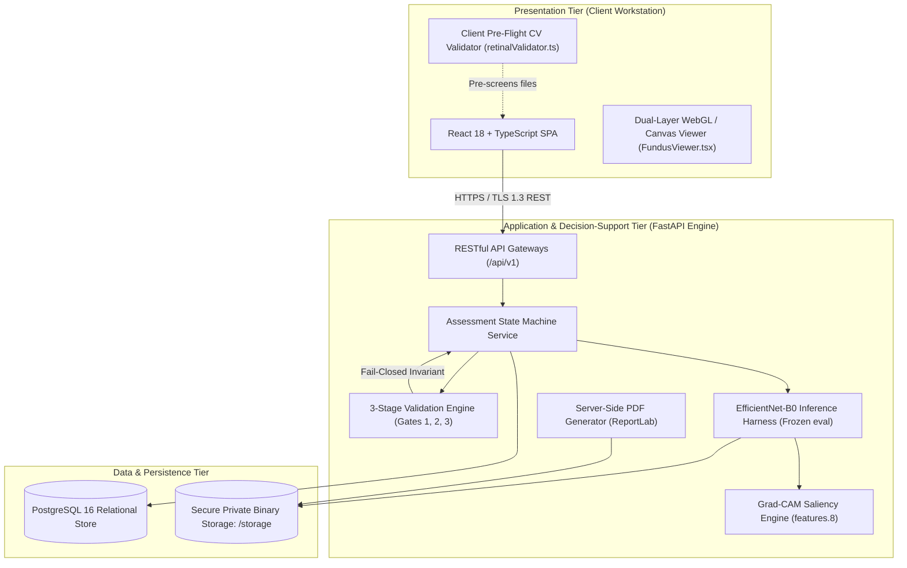
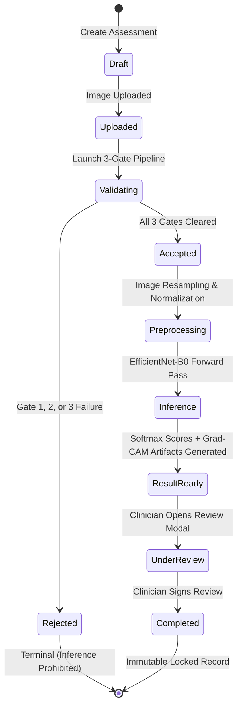

# System Architecture & Ophthalmic Data Flow Specification

## Metadata & Traceability
- **Research Project:** AI-Based Clinical Decision Support System for Early Detection of Diabetic Retinopathy
- **Author / Researcher:** Onyekelu Chukwuebuka Elochukwu (2024516020FN)
- **Related Research Objective:** Objective g (Design CDSS software architecture)
- **Git Commit:** `22cda2c` (Baseline)
- **Date Approved:** 2026-09-28

---

## 1. High-Level Architectural Tiers

The Diabetic Retinopathy Clinical Decision Support System (DR-CDSS) is designed as a secure, decoupled three-tier clinical application tailored for low-resource ophthalmic workstations and hospital local area networks:



---

## 2. Data Flow Diagram (DFD Level 1) with Standardised Notation

> [!IMPORTANT]
> **Supervisor Notation Requirement:** In compliance with formal structured systems analysis conventions, external entities (sources and sinks of clinical data) are rendered with **two square-corner offset rectangles** representing the external boundary of the system.

### Visual Representation of External Entities & Processes:

```text
+-----------------------+
|  CLINICIAN / OPERATOR |-----+
+-----------------------+     | (Offset rectangle indicates External Entity)
  |   +-----------------------+
  |   |  CLINICIAN / OPERATOR |
  |   +-----------------------+
  |
  | 1. Uploads Fundus Image + Patient ID
  v
+-------------------------------------------------------+
| Process 1.0: Ingest & 3-Gate Technical Validation     |
+-------------------------------------------------------+
  |
  +---[Gate 1/2/3 Failure]---> State: Rejected (Inference Aborted)
  |                                 |
  |                                 v
  |                           +-----------------------+
  |                           |  AUDIT EVENT LOG      |-----+
  |                           +-----------------------+     |
  |                             +-----------------------+   |
  |                             |  AUDIT EVENT LOG      |---+
  |                             +-----------------------+
  |
  +---[All Gates Passed]
  |
  v
+-------------------------------------------------------+
| Process 2.0: Preprocessing & Frozen Neural Inference  |
| (EfficientNet-B0 backbone: features.8 hook)           |
+-------------------------------------------------------+
  |
  | 2. Computes 5-Class Score Distribution & Grad-CAM Heatmap
  v
+-------------------------------------------------------+
| Process 3.0: Presentation & Decision Support View     |
+-------------------------------------------------------+
  |
  | 3. Displays Interactive Dual-Layer Visual Attribution
  v
+-----------------------+
| REVIEWING OPHTHALMOL. |-----+
+-----------------------+     |
  |   +-----------------------+
  |   | REVIEWING OPHTHALMOL. |
  |   +-----------------------+
  |
  | 4. Submits Official Review (Agree / Disagree / Unable to determine)
  v
+-------------------------------------------------------+
| Process 4.0: Review Sign-off, Report & Audit Storage |
+-------------------------------------------------------+
  |
  +---> Persists immutable review to PostgreSQL
  +---> Generates tamper-evident Assessment Report PDF
```

---

## 3. The 9-Stage Assessment Lifecycle State Machine



---

## 4. Key Architectural Safeguards & Design Decisions

1. **Physical & Logical Domain Separation:**
   - Model predictions (`ai_results`) and professional review responses (`professional_reviews`) reside in separate database entities. Nothing automated writes to a review.
2. **Deterministic Weights Preservation:**
   - The PyTorch inference harness loads weights in read-only mode (`torch.load(..., weights_only=True)`), explicitly sets `model.eval()`, and disables parameter autograd tracking (`requires_grad = False`).
3. **Fail-Closed Gate Architecture:**
   - Any failure across file integrity, spectral balance, or blur thresholds guarantees that no tensor forward pass is initiated, preventing invalid classification of corrupted data.
4. **Offline Local First Capability:**
   - The complete request path runs on the deployment CPU — **mean 180.41 ms, P95 342.49 ms** end-to-end over 30 held-out images on the canonical run ([`resource_benchmark.md`](resource_benchmark.md) §1), of which the forward pass itself is 29.22 ms — so the system needs no external cloud AI API and no image leaves the host.
