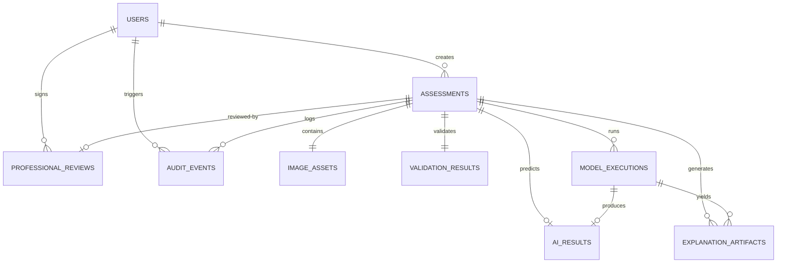

# Relational Database Schema & Data Dictionary

## Metadata & Traceability
- **Research Project:** AI-Based Clinical Decision Support System for Early Detection of Diabetic Retinopathy
- **Author / Researcher:** Onyekelu Chukwuebuka Elochukwu (2024516020FN)
- **Related Research Objective:** Objective g (Design CDSS software architecture)
- **Database Engine:** PostgreSQL 16 (Relational Engine with JSONB support)
- **ORM Mapping:** SQLAlchemy 2.0 / Pydantic v2
- **Git Commit:** `22cda2c` (Baseline)
- **Date Approved:** 2026-09-28

---

## 1. Entity-Relationship Overview

The database design adheres strictly to third normal form (3NF) while maintaining absolute physical domain separation between automated model observations and human clinical certifications:

---

## 2. Table Dictionaries & Field Specifications

### 1. `users`
*Represents authorized screening practitioners, consultant medical ophthalmologists, and system administrators.*

| Column | Type | Nullable | Description / Constraint |
| :--- | :--- | :---: | :--- |
| `id` | VARCHAR(36) | NO | Primary Key (UUIDv4). |
| `username` | VARCHAR(100) | NO | Unique login handle. |
| `email` | VARCHAR(255) | NO | Unique clinical email address. |
| `full_name` | VARCHAR(255) | NO | Full legal and professional title. |
| `hashed_password` | VARCHAR(255) | NO | Bcrypt/Argon2 salted hash (zero plaintext). |
| `role` | VARCHAR(50) | NO | `clinician`, `technician`, `administrator`. |
| `license_number` | VARCHAR(100) | YES | Medical council or Clinician ID number. |
| `facility` | VARCHAR(255) | YES | Hospital unit or primary eye clinic name. |
| `is_active` | BOOLEAN | NO | Account state flag. |
| `created_at` | TIMESTAMPTZ | NO | Timestamp of registration. |

### 2. `assessments`
*Core clinical encounter record representing a single patient eye examination.*

| Column | Type | Nullable | Description / Constraint |
| :--- | :--- | :---: | :--- |
| `id` | VARCHAR(64) | NO | Primary Key (Format: `REC-YYYY-XXXXXX`). |
| `patient_id` | VARCHAR(100) | NO | Pseudonymized patient study identifier. |
| `eye_laterality` | VARCHAR(10) | NO | `OD` (Right Eye) or `OS` (Left Eye). |
| `camera_model` | VARCHAR(255) | YES | Make and model of fundus camera. |
| `is_mydriatic` | BOOLEAN | NO | Pupillary dilation indicator. |
| `clinical_notes` | TEXT | YES | Indication or clinical history notes. |
| `status` | VARCHAR(50) | NO | State machine status (e.g. `needs_review`, `completed`, `rejected`). |
| `created_by_id` | VARCHAR(36) | YES | Foreign Key (`users.id`). |
| `created_at` | TIMESTAMPTZ | NO | Encounter creation timestamp. |
| `updated_at` | TIMESTAMPTZ | NO | Last status transition timestamp. |

### 3. `image_assets`
*Tracks original photographic fundus binaries, dimensions, and cryptographic hashes.*

| Column | Type | Nullable | Description / Constraint |
| :--- | :--- | :---: | :--- |
| `id` | VARCHAR(36) | NO | Primary Key (UUIDv4). |
| `assessment_id` | VARCHAR(64) | NO | Foreign Key (`assessments.id`, Unique). |
| `storage_path` | VARCHAR(512) | NO | Local disk or object storage filepath. |
| `filename` | VARCHAR(255) | NO | Randomized file identifier. |
| `mime_type` | VARCHAR(50) | NO | `image/jpeg` or `image/png`. |
| `file_size_bytes`| INTEGER | NO | Binary payload byte count. |
| `sha256_hash` | VARCHAR(64) | NO | SHA-256 cryptographic digest of raw bytes. |
| `width` | INTEGER | NO | Native pixel width. |
| `height` | INTEGER | NO | Native pixel height. |

### 4. `validation_results`
*Records the empirical outputs and status of Gates 1, 2, and 3.*

| Column | Type | Nullable | Description / Constraint |
| :--- | :--- | :---: | :--- |
| `id` | VARCHAR(36) | NO | Primary Key (UUIDv4). |
| `assessment_id` | VARCHAR(64) | NO | Foreign Key (`assessments.id`, Unique). |
| `gate1_passed` | BOOLEAN | NO | File integrity and MIME verification flag. |
| `gate2_passed` | BOOLEAN | NO | Retinal geometry and spectral balance flag. |
| `gate3_passed` | BOOLEAN | NO | Laplacian blur and illumination flag. |
| `laplacian_variance` | FLOAT | YES | Measured focus metric ($\sigma_L^2$). |
| `illumination_index` | FLOAT | YES | Normalized luminance score ($\bar{Y}$). |
| `aspect_ratio` | FLOAT | YES | Measured width-to-height ratio. |
| `failed_gate` | INTEGER | YES | Gate index triggering failure ($1, 2, 3$). |
| `failure_reason` | TEXT | YES | Non-diagnostic technical explanation. |

### 5. `ai_results`
*Stores purely algorithmic observations derived from the pre-trained EfficientNet-B0.*

| Column | Type | Nullable | Description / Constraint |
| :--- | :--- | :---: | :--- |
| `id` | VARCHAR(36) | NO | Primary Key (UUIDv4). |
| `assessment_id` | VARCHAR(64) | NO | Foreign Key (`assessments.id`, Unique). |
| `primary_class_grade` | INTEGER | NO | Predicted ICDR stage index ($0-4$). |
| `primary_class_label` | VARCHAR(100) | NO | String label (e.g. `Moderate NPDR`). |
| `primary_score` | FLOAT | NO | Model-generated class score ($0.0-1.0$). |
| `class_scores` | JSONB | NO | Full 5-class normalized score breakdown. |
| `target_layer` | VARCHAR(100) | NO | Convolutional layer hooked (`features.8`). |
| `model_version` | VARCHAR(100) | NO | Architecture identifier and weights tag. |
| `execution_time_ms` | FLOAT | NO | Millisecond forward pass compute latency. |
| `disclaimer` | TEXT | NO | Mandated non-diagnostic boundary notice. |

### 6. `professional_reviews`
*Professional review response recorded alongside the model observation. Not a diagnosis, referral or legal instrument.*

| Column | Type | Nullable | Description / Constraint |
| :--- | :--- | :---: | :--- |
| `id` | VARCHAR(36) | NO | Primary Key (UUIDv4). |
| `assessment_id` | VARCHAR(64) | NO | Foreign Key (`assessments.id`, Unique). |
| `reviewer_id` | VARCHAR(36) | NO | Foreign Key (`users.id`). |
| `clinician_name` | VARCHAR(255) | NO | Denormalized signatory name. |
| `license_number` | VARCHAR(100) | YES | Medical practitioner registration code. |
| `agreement` | VARCHAR(50) | NO | `agree`, `disagree`, `inconclusive`. |
| `reviewer_assessed_grade` | INTEGER | NO | The reviewing clinician's own ICDR grade ($0-4$), recorded independently of the model's observation. |
| `reviewer_assessed_grade_label` | VARCHAR(100) | NO | Text form of that grade. |
| `justification_notes` | TEXT | YES | Optional clinician rationale. |
| `inconclusive_reason` | VARCHAR(255) | YES | Specific ambiguity category if inconclusive. |
| `signature_hash` | VARCHAR(64) | NO | Cryptographic integrity hash of review fields. |
| `signed_at` | TIMESTAMPTZ | NO | Immutability lock timestamp. |

> [!NOTE]
> **This table is transcribed from `backend/app/models/models.py`, class
> `ProfessionalReview`.** An earlier revision of this document described columns
> named `certified_grade`, `certified_grade_label` and `referral_plan`. The first
> two were renamed in the code and the document was not updated; the third has
> never existed on the model at all. A schema document describing a table the
> system does not have is worse than none, and the terminology it used was the
> same certification language the scope rules exclude.

### 7. `audit_events`
*Append-only tamper-evident compliance log tracking every interaction.*

| Column | Type | Nullable | Description / Constraint |
| :--- | :--- | :---: | :--- |
| `id` | VARCHAR(36) | NO | Primary Key (UUIDv4). |
| `assessment_id` | VARCHAR(64) | YES | Associated assessment identifier. |
| `user_id` | VARCHAR(36) | YES | Foreign Key (`users.id`). |
| `event_type` | VARCHAR(100) | NO | e.g. `CREATED`, `VALIDATED`, `INFERRED`, `REVIEWED`. |
| `details` | JSONB | NO | Structured telemetry payload. |
| `created_at` | TIMESTAMPTZ | NO | Timestamp of occurrence. |
