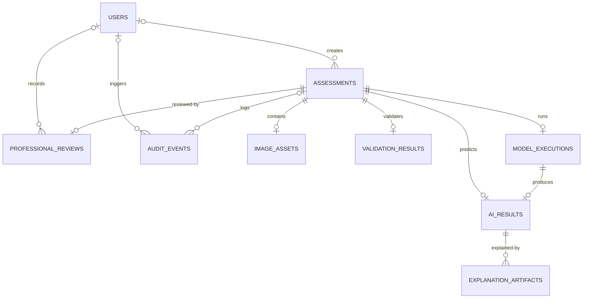

# Relational Database Schema & Data Dictionary

## Metadata & Traceability
- **Research Project:** AI-Based Clinical Decision Support System for Early Detection of Diabetic Retinopathy
- **Author / Researcher:** Onyekelu Chukwuebuka Elochukwu (2024516020FN)
- **Related Research Objective:** Objective a (System architecture, workflow & database design)
- **Database Engine:** PostgreSQL 16 (`postgres:16-alpine`); columns typed `JSON` in the model map to PostgreSQL `json`
- **ORM Mapping:** SQLAlchemy 2.1.3 / Pydantic 2.13.5
- **Last Revised:** 2026-10-04 (transcribed from `backend/app/models/models.py`; checked by rule group X)

---

## 1. Entity-Relationship Overview

The database design is generally normalised, with one documented denormalisation: `professional_reviews` copies the signatory's name, registration code and facility at recording time so a review keeps the identity it was recorded under even if the user record later changes. Model observations and professional review responses are logically separated in distinct tables of the same PostgreSQL database — separate tables, not separate physical stores:

Cardinalities are read from the model: a nullable foreign key draws the parent as optional (`|o`), a `NOT NULL` one as mandatory (`||`); a `UNIQUE` foreign key draws the child as at most one (`o|`), otherwise many (`o{`). An assessment is created as `draft` before it has an image, a validation result or a run, so those children are optional. A rule in the suite checks every edge against the declared `ForeignKey` columns.

---

## 2. Table Dictionaries & Field Specifications

### 1. `users`
*Represents authorized screening practitioners, consultant medical ophthalmologists, and system administrators.*

| Column | Type | Nullable | Description / Constraint |
| :--- | :--- | :---: | :--- |
| `id` | VARCHAR(36) | NO | Primary Key (UUIDv4). |
| `username` | VARCHAR(100) | NO | Unique login handle, indexed. |
| `email` | VARCHAR(255) | NO | Unique clinical email address, indexed. |
| `full_name` | VARCHAR(255) | NO | Full legal and professional title. |
| `hashed_password` | VARCHAR(255) | NO | Bcrypt salted hash (zero plaintext). |
| `role` | VARCHAR(50) | NO | `clinician`, `technician`, `admin`. Defaults to `clinician`. |
| `license_number` | VARCHAR(100) | YES | Practitioner registration code. Simulated in this build (e.g. `SIM-000001`). |
| `facility` | VARCHAR(255) | YES | Hospital unit or primary eye clinic name. |
| `is_active` | BOOLEAN | NO | Account state flag. Defaults to true. |
| `created_at` | TIMESTAMPTZ | NO | Timestamp of registration. |
| `updated_at` | TIMESTAMPTZ | NO | Last modification timestamp, set on update. |

### 2. `assessments`
*Core clinical encounter record representing a single patient eye examination.*

| Column | Type | Nullable | Description / Constraint |
| :--- | :--- | :---: | :--- |
| `id` | VARCHAR(64) | NO | Primary Key (Format: `REC-YYYY-XXXXXX`). |
| `patient_id` | VARCHAR(100) | NO | Pseudonymized patient study identifier. |
| `eye_laterality` | VARCHAR(10) | NO | `OD` (Right Eye) or `OS` (Left Eye). |
| `camera_model` | VARCHAR(255) | YES | Make and model of fundus camera. |
| `is_mydriatic` | BOOLEAN | NO | Pupillary dilation indicator. |
| `clinical_notes` | TEXT | YES | Indication or clinical history notes. |
| `status` | VARCHAR(50) | NO | Stored state-machine status: `accepted`, `completed`, `draft`, `inference`, `preprocessing`, `rejected`, `result_ready`, `uploaded`, `validating`. (`needs_review` is a display status derived for the worklist; it is never stored.) |
| `created_by_id` | VARCHAR(36) | YES | Foreign Key (`users.id`). |
| `created_at` | TIMESTAMPTZ | NO | Encounter creation timestamp. |
| `updated_at` | TIMESTAMPTZ | NO | Last status transition timestamp. |

### 3. `image_assets`
*Tracks original photographic fundus binaries, dimensions, and SHA-256 hashes.*

| Column | Type | Nullable | Description / Constraint |
| :--- | :--- | :---: | :--- |
| `id` | VARCHAR(36) | NO | Primary Key (UUIDv4). |
| `assessment_id` | VARCHAR(64) | NO | Foreign Key (`assessments.id`, Unique, `ON DELETE CASCADE`). |
| `original_filename` | VARCHAR(255) | NO | Filename as supplied by the uploading client. |
| `stored_filename` | VARCHAR(255) | NO | Randomized on-disk identifier, decoupled from the original. |
| `storage_path` | VARCHAR(500) | NO | Local disk or object storage filepath. |
| `file_size_bytes` | INTEGER | NO | Binary payload byte count. |
| `mime_type` | VARCHAR(100) | NO | `image/jpeg` or `image/png`, as sniffed from content. |
| `sha256_hash` | VARCHAR(64) | NO | SHA-256 digest of raw bytes. |
| `width` | INTEGER | YES | Native pixel width. Null if the image could not be decoded. |
| `height` | INTEGER | YES | Native pixel height. Null if the image could not be decoded. |
| `created_at` | TIMESTAMPTZ | NO | Timestamp of ingestion. |

### 4. `validation_results`
*Records the empirical outputs and status of Gates 1, 2, and 3.*

| Column | Type | Nullable | Description / Constraint |
| :--- | :--- | :---: | :--- |
| `id` | VARCHAR(36) | NO | Primary Key (UUIDv4). |
| `assessment_id` | VARCHAR(64) | NO | Foreign Key (`assessments.id`, Unique, `ON DELETE CASCADE`). |
| `status` | VARCHAR(50) | NO | `passed` or `rejected`. |
| `gate1_passed` | BOOLEAN | NO | File integrity and MIME verification flag. |
| `gate1_details` | JSON | NO | Per-check measurements from Gate 1. |
| `gate2_passed` | BOOLEAN | YES | Retinal geometry and spectral balance flag. Null if Gate 1 rejected first. |
| `gate2_details` | JSON | YES | Per-check measurements from Gate 2. |
| `gate3_passed` | BOOLEAN | YES | Laplacian blur and illumination flag. Null if an earlier gate rejected first. |
| `gate3_details` | JSON | YES | Per-check measurements from Gate 3. |
| `failed_gate` | INTEGER | YES | Gate index triggering failure ($1, 2, 3$). Null when accepted. |
| `failure_code` | VARCHAR(100) | YES | Stable machine-readable rejection code. |
| `failure_reason` | TEXT | YES | Non-diagnostic technical explanation. |
| `actionable_guidance` | TEXT | YES | What the operator should change before retrying. |
| `laplacian_variance` | FLOAT | YES | Measured focus metric ($\sigma_L^2$). |
| `illumination_index` | FLOAT | YES | 1 − proportion of extreme-luminance pixels (higher is better); Gate 3 rejects when that proportion exceeds `ILLUMINATION_EXTREME_RATIO_MAX` (0.35), i.e. when the index falls below 0.65. An earlier revision described the inverse. |
| `contrast_dynamic_range` | FLOAT | YES | Measured contrast standard deviation. |
| `native_resolution` | VARCHAR(50) | YES | Submitted dimensions as `WxH`, before any analysis subsampling. |
| `evaluated_at` | TIMESTAMPTZ | NO | Timestamp the gates were run. |

> [!NOTE]
> Gates 2 and 3 are nullable because the pipeline **fails closed and stops at
> the first rejection**: a file that fails Gate 1 is never decoded, so no Gate 2
> or Gate 3 measurement exists to record. A null here means "not reached", never
> "passed".

### 5. `ai_results`
*Stores purely algorithmic observations derived from the pre-trained EfficientNet-B0.*

| Column | Type | Nullable | Description / Constraint |
| :--- | :--- | :---: | :--- |
| `id` | VARCHAR(36) | NO | Primary Key (UUIDv4). |
| `assessment_id` | VARCHAR(64) | NO | Foreign Key (`assessments.id`, Unique, `ON DELETE CASCADE`). |
| `model_execution_id` | VARCHAR(36) | NO | Foreign Key (`model_executions.id`, Unique, `ON DELETE CASCADE`). Ties this observation to the run that produced it, including the checkpoint digest. |
| `primary_class_grade` | INTEGER | NO | Predicted ICDR stage index ($0-4$). |
| `primary_class_label` | VARCHAR(100) | NO | String label (e.g. `Moderate NPDR`). |
| `primary_score` | FLOAT | NO | Model-generated class score ($0.0-1.0$). |
| `class_scores` | JSON | NO | Full 5-class breakdown: `{grade, label, score}` per class. |
| `target_layer` | VARCHAR(100) | NO | Convolutional layer hooked for Grad-CAM (`features.8`). |
| `top_activation_region` | VARCHAR(255) | YES | Coarse descriptor of the highest-activation area. |
| `disclaimer` | TEXT | NO | Mandated non-diagnostic boundary notice. |
| `created_at` | TIMESTAMPTZ | NO | Timestamp of inference. |

> [!NOTE]
> Model version and timing are **not** columns on this table. They live on
> `model_executions`, reached through `model_execution_id`, so that one
> execution record carries the checkpoint digest, device and latency for every
> observation derived from it. An earlier revision of this document listed
> `model_version` and `execution_time_ms` here; neither has ever existed on
> `AIResult`.

### 6. `professional_reviews`
*Professional review response recorded alongside the model observation. Not a diagnosis, referral or legal instrument.*

| Column | Type | Nullable | Description / Constraint |
| :--- | :--- | :---: | :--- |
| `id` | VARCHAR(36) | NO | Primary Key (UUIDv4). |
| `assessment_id` | VARCHAR(64) | NO | Foreign Key (`assessments.id`, Unique, `ON DELETE CASCADE`). |
| `reviewer_id` | VARCHAR(36) | YES | Foreign Key (`users.id`, `ON DELETE RESTRICT`). Nullable so a review survives if the account is later removed; `RESTRICT` means removal is refused while reviews reference it. |
| `agreement` | VARCHAR(50) | NO | `agree`, `disagree`, `inconclusive`. |
| `reviewer_assessed_grade` | INTEGER | NO | The reviewing professional's own ICDR grade ($0-4$), recorded independently of the model's observation. |
| `reviewer_assessed_grade_label` | VARCHAR(100) | NO | Text form of that grade. |
| `justification_notes` | TEXT | YES | Optional rationale. |
| `inconclusive_reason` | VARCHAR(255) | YES | Specific ambiguity category if inconclusive. |
| `clinician_name` | VARCHAR(255) | NO | Denormalized signatory name, captured at signing time. |
| `license_number` | VARCHAR(100) | YES | Practitioner registration code, captured at signing time. |
| `facility` | VARCHAR(255) | YES | Reviewing site, captured at signing time. |
| `signature_hash` | VARCHAR(128) | NO | Unkeyed SHA-256 (truncated to 24 hex characters) over assessment id, patient id, image hash, agreement, grade, justification, inconclusive reason, signatory name, licence, facility and timestamp. It anchors the recorded values; it does not prove who recorded them. |
| `is_immutable` | BOOLEAN | NO | Write-lock flag. Defaults to true: once a review is recorded the API refuses a second one (state machine); the database itself does not enforce it. |
| `signed_at` | TIMESTAMPTZ | NO | Time the review was recorded (the API write-lock applies from then). The column names `signature_hash` / `signed_at` are historical; the value is a record hash anchor, not a signature, and the stored prefix is `HASH-SHA256-`. |

> [!NOTE]
> **This table is transcribed from `backend/app/models/models.py`, class
> `ProfessionalReview`.** An earlier revision described columns named
> `certified_grade`, `certified_grade_label`, `referral_plan` and
> `clinician_id`. The first two were renamed in the code and the document was
> not updated; the last two have never existed on the model. It also omitted
> `facility` and `is_immutable`, gave `signature_hash` as VARCHAR(64), and
> recorded `reviewer_id` as NOT NULL. A schema document describing a table the
> system does not have is worse than none.
>
> The three identity columns are denormalized **deliberately**: a recorded review
> must keep the name, registration code and site as they stood when it was
> signed, even if the user record changes afterwards.

### 7. `audit_events`
*Application-level append-only event log recording every interaction.*

| Column | Type | Nullable | Description / Constraint |
| :--- | :--- | :---: | :--- |
| `id` | VARCHAR(64) | NO | Primary Key (Format: `AUD-XXXXXX`). |
| `assessment_id` | VARCHAR(64) | YES | Foreign Key (`assessments.id`, `ON DELETE SET NULL`), indexed. |
| `user_id` | VARCHAR(36) | YES | Foreign Key (`users.id`, `ON DELETE SET NULL`). |
| `action` | VARCHAR(150) | NO | Event name, e.g. `CREATED`, `VALIDATED`, `INFERRED`, `REVIEWED`. |
| `actor` | VARCHAR(150) | NO | Human-readable actor label, retained if `user_id` is later nulled. |
| `details` | TEXT | NO | Human-readable description of the event. |
| `badge_type` | VARCHAR(30) | NO | Display severity: `info`, `success`, `warning`, `error`. Defaults to `info`. |
| `event_metadata` | JSON | YES | Structured telemetry payload. |
| `ip_address` | VARCHAR(60) | YES | Originating address, where available. |
| `timestamp` | TIMESTAMPTZ | NO | Timestamp of occurrence, indexed. |

> [!NOTE]
> The column is `action`, not `event_type`, and `timestamp`, not `created_at`;
> `details` is TEXT and the structured payload lives in `event_metadata`. An
> earlier revision of this document had all four wrong. `ON DELETE SET NULL` on
> both foreign keys is what makes the log application-level append-only in practice: removing a
> user or an assessment blanks the reference but never deletes the event. The ORM
> relationship is declared `passive_deletes=True` with no delete cascade, so the
> database rule is the one that applies; an earlier revision of the model cascaded
> deletes at the ORM level, which contradicted this paragraph. No API route deletes
> assessments or users.
>
> **Limitation.** The application does not expose audit-event update or deletion operations, and assessment deletion does not cascade to audit events. However, database-level immutability is not enforced through triggers or restricted database privileges.

### 8. `model_executions`
*One row per inference run: which model, in which mode, on which device, and how long. `ai_results` points here, so every observation is tied to the run that produced it.*

| Column | Type | Nullable | Description / Constraint |
| :--- | :--- | :---: | :--- |
| `id` | VARCHAR(36) | NO | Primary Key (UUIDv4). |
| `assessment_id` | VARCHAR(64) | NO | Foreign Key (`assessments.id`, Unique, `ON DELETE CASCADE`). One run per assessment. |
| `model_name` | VARCHAR(100) | NO | Defaults to `EfficientNet-B0`. |
| `model_version` | VARCHAR(100) | NO | Defaults to `EfficientNet-B0-DR-v1 (fixed weights)`. |
| `execution_mode` | VARCHAR(50) | NO | Defaults to `evaluation`, the only mode: there is no in-service learning path. |
| `device` | VARCHAR(50) | NO | Defaults to `cpu`. |
| `execution_time_ms` | FLOAT | NO | Wall-clock time of the run. Defaults to 0.0. |
| `started_at` | TIMESTAMPTZ | NO | Run start. |
| `completed_at` | TIMESTAMPTZ | NO | Run end. |

### 9. `explanation_artifacts`
*Grad-CAM overlays and their rendering parameters, one row per artefact, keyed to the observation they explain.*

| Column | Type | Nullable | Description / Constraint |
| :--- | :--- | :---: | :--- |
| `id` | VARCHAR(36) | NO | Primary Key (UUIDv4). |
| `ai_result_id` | VARCHAR(36) | NO | Foreign Key (`ai_results.id`, `ON DELETE CASCADE`). |
| `artifact_type` | VARCHAR(50) | NO | Defaults to `gradcam_heatmap`. |
| `storage_path` | VARCHAR(500) | NO | On-disk path of the rendered PNG. |
| `relative_url` | VARCHAR(500) | YES | URL the API serves it at, when exposed. |
| `target_layer` | VARCHAR(100) | NO | Layer hooked for Grad-CAM. Defaults to `features.8`. |
| `colormap` | VARCHAR(50) | NO | Defaults to `viridis`. |
| `metadata_json` | JSON | YES | Rendering parameters and activation statistics. |
| `created_at` | TIMESTAMPTZ | NO | Timestamp of rendering. |

> [!NOTE]
> These two tables were absent from earlier revisions of this document, which
> described seven of the nine mapped tables. The rule that checks this document
> against the model now requires the two sets of tables to be equal, and checks
> the diagram above against the declared foreign keys.
