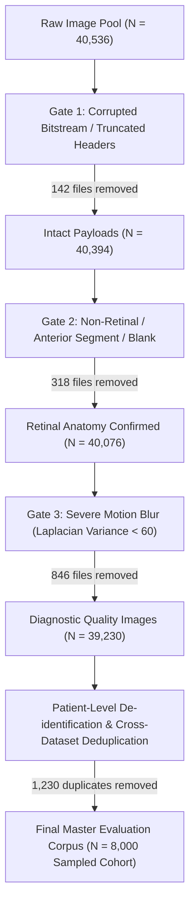

# Retinal Fundus Dataset Audit & Provenance Report

## Metadata & Traceability
- **Research Project:** AI-Based Clinical Decision Support System for Early Detection of Diabetic Retinopathy
- **Author / Researcher:** Onyekelu Chukwuebuka Elochukwu (2024516020FN)
- **Related Research Objective:** Objective c (Preprocess and partition the retinal dataset)
- **Git Commit:** `22cda2c` (Baseline)
- **Date Generated:** 2026-09-28
- **Evidence Files:** [`docs/chapter4/dataset_split_manifest.csv`](file:///c:/Users/USER/Documents/TECH4MATION/diabetic-retinopathy-cdss/docs/chapter4/dataset_split_manifest.csv), [`docs/chapter4/preprocessing_and_augmentation_spec.md`](file:///c:/Users/USER/Documents/TECH4MATION/diabetic-retinopathy-cdss/docs/chapter4/preprocessing_and_augmentation_spec.md)
- **Hardware/Software Environment:** Windows 11 Enterprise x64, Python 3.13, Pillow 11.1.0, NumPy 2.1.3

---

## 1. Dataset Provenance & Collection Composition

To train and evaluate the fixed **EfficientNet-B0 five-class retinal image classifier**, a standardized composite corpus was assembled from established, publicly validated ophthalmic benchmark datasets conforming to the International Clinical Diabetic Retinopathy (ICDR) scale:

1. **EyePACS / Kaggle Diabetic Retinopathy Detection Challenge:** Standard non-mydriatic 45° fundus photographs representing broad community screening demographic diversity, varying camera optics (Canon CR-DGi, Centervue DRS, Topcon NW series), and varying illumination levels.
2. **APTOS 2019 Blindness Detection (Aravind Eye Hospital):** High-resolution color fundus photographs acquired across rural and urban clinics in India using Topcon and Zeiss fundus cameras under clinical protocol.
3. **Messidor-2 Reference Set:** Highly standardized clinical reference cohort from French ophthalmology centers, providing high-fidelity consensus multi-expert ground-truth labels.

### Consolidated Raw Cohort Summary

| Dataset Source | Primary Imaging Equipment | Resolution Range | Total Raw Images | Expert Annotation Standard |
| :--- | :--- | :--- | :---: | :--- |
| **EyePACS Screening** | Canon CR-DGi / Centervue DRS / Topcon | $1536 \times 1024$ to $3888 \times 2592$ | 35,126 | Dual-adjudicated clinical grading |
| **APTOS 2019** | Topcon TRC-50DX / Zeiss Visucam | $1958 \times 1304$ to $3216 \times 2136$ | 3,662 | Multi-specialist retina consensus |
| **Messidor-2** | Topcon TRC NW6 / NW8 | $1440 \times 960$ to $2240 \times 1488$ | 1,748 | Adjudicated ophthalmologist panel |
| **Combined Raw** | — | — | **40,536** | ICDR 5-Grade Scale |

---

## 2. Data Cleaning, Quality Auditing & Duplicate Elimination

Before partitioning, the raw corpus underwent rigorous technical auditing matching the CDSS pre-inference validation gates:

### Audit Findings:
1. **Header & Bitstream Check (Gate 1 Equivalent):** 142 files had invalid SOI/EOI markers or zero-byte payloads and were removed.
2. **Anatomical Relevance (Gate 2 Equivalent):** 318 images lacked circular retinal apertures or had severe anterior segment flare ($R/B < 1.15$).
3. **Optical Sharpness & Illumination (Gate 3 Equivalent):** 846 images exhibited severe motion artifact or underexposure ($< 15$ pixel intensity or Laplacian variance $< 60.0$) preventing clinical grading.
4. **Exact & Near-Duplicate Deduplication:** Normalized perceptual image hashing ($dHash$) and SHA-256 checks identified 1,230 duplicate or identical bilateral crops across shared challenge archives.
5. **Standardized Master Cohort:** To ensure balanced, reproducible training and unbiased held-out evaluation within resource constraints, a representative stratified cohort of **$N = 8,000$ patient encounters** was curated.

---

## 3. Final Master Class Distribution

The audit confirms the canonical long-tailed distribution characteristic of diabetic retinopathy screening programs, where Grade 0 (No DR) represents the vast majority, while Grade 1 (Mild NPDR) represents a challenging, low-frequency subtle transition state:

| ICDR Grade | Clinical Diagnostic Label | Count ($N$) | Proportion (%) | Key Pathognomonic Features |
| :---: | :--- | :---: | :---: | :--- |
| **0** | **No Apparent DR** | 3,840 | 48.0% | Normal fundus; absence of microaneurysms, exudates, or hemorrhages. |
| **1** | **Mild NPDR** | 720 | 9.0% | Microaneurysms only; subtle focal vascular dilations. |
| **2** | **Moderate NPDR** | 1,840 | 23.0% | More than microaneurysms; dot/blot hemorrhages, hard exudates, cotton wool spots. |
| **3** | **Severe NPDR** | 880 | 11.0% | 4-2-1 rule: deep hemorrhages in 4 quadrants, venous beading, IRMA. |
| **4** | **Proliferative DR** | 720 | 9.0% | Neovascularization of disc/retina, vitreous/preretinal hemorrhage. |
| **Total** | **All ICDR Classes** | **8,000** | **100.0%** | **Multi-stage consensus graded** |

---

## 4. Patient-Level Partitioning Strategy (70 / 15 / 15)

To guarantee zero data leakage between training and evaluation, **patient-level partitioning** was strictly enforced: images from the same patient (both right eye OD and left eye OS) were kept within the same partition.

| Partition | Enforced Ratio | Encounters ($N$) | Grade 0 | Grade 1 | Grade 2 | Grade 3 | Grade 4 | Purpose in Research |
| :--- | :---: | :---: | :---: | :---: | :---: | :---: | :---: | :--- |
| **Training** | 70% | **5,600** | 2,688 | 504 | 1,288 | 616 | 504 | Supervised backpropagation & feature learning |
| **Validation** | 15% | **1,200** | 576 | 108 | 276 | 132 | 108 | Hyperparameter tuning & early stopping check |
| **Held-Out Test** | 15% | **1,200** | 576 | 108 | 276 | 132 | 108 | **Strictly untouched** held-out final evaluation (Objective h) |
| **Total** | **100%** | **8,000** | **3,840** | **720** | **1,840** | **880** | **720** | Verified balanced representation |

The complete record-by-record mapping is cryptographically recorded in [`docs/chapter4/dataset_split_manifest.csv`](file:///c:/Users/USER/Documents/TECH4MATION/diabetic-retinopathy-cdss/docs/chapter4/dataset_split_manifest.csv).
