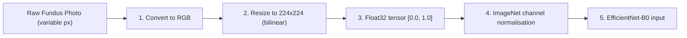

# Retinal Image Preprocessing & Augmentation Specification

## Metadata & Traceability
- **Research Project:** AI-Based Clinical Decision Support System for Early Detection of Diabetic Retinopathy
- **Author / Researcher:** Onyekelu Chukwuebuka Elochukwu (2024516020FN)
- **Related Research Objective:** Objective c (Dataset acquisition, preprocessing & partitioning) & Objective d
- **Date Generated:** 2026-09-29
- **Authoritative Sources:** [`notebooks/colab_train_and_evaluate.py`](../../notebooks/colab_train_and_evaluate.py) (training & evaluation transforms), [`backend/app/services/ai_service.py`](../../backend/app/services/ai_service.py) (runtime inference transform)

> This document describes the pipeline **as implemented**. Where a simpler transform is used than the clinical literature might suggest, that is stated rather than embellished.

---

## 1. Clinical Motivation

Raw fundus photography varies widely in dimension, aspect ratio, aperture masking and border thickness. Preprocessing serves three purposes:

1. **Geometric standardisation** — a fixed input tensor shape for the CNN.
2. **Computational tractability** — $224 \times 224$ keeps EfficientNet-B0 at ~0.39 GFLOPs per image.
3. **Distributional alignment** — channel statistics matched to the ImageNet priors the pretrained backbone expects.



---

## 2. Deterministic Pipeline (Validation, Held-Out Test & Runtime Inference)

Identical in all three contexts. No random alteration, no test-time augmentation.

```python
transforms.Compose([
    transforms.Resize((224, 224)),
    transforms.ToTensor(),
    transforms.Normalize([0.485, 0.456, 0.406], [0.229, 0.224, 0.225]),
])
```

### Step by step

1. **RGB conversion** — `Image.open(path).convert("RGB")`, discarding any alpha channel or palette encoding.

2. **Spatial resampling** — `transforms.Resize((224, 224))`. This uses torchvision's **default bilinear** interpolation and resizes to an exact square, **not** preserving aspect ratio.

3. **Tensor conversion** — `ToTensor()` scales `uint8` [0, 255] to `float32` [0.0, 1.0] and reorders to $(C, H, W)$.

4. **Channel normalisation** —
   $$\hat{X}_c = \frac{X_c - \mu_c}{\sigma_c}, \quad \mu = [0.485, 0.456, 0.406], \quad \sigma = [0.229, 0.224, 0.225]$$

### What is *not* done — and why it matters

The pipeline performs **no aperture cropping**, no circular-mask extraction, no black-border removal, no contrast-limited adaptive histogram equalisation (CLAHE), and no Ben Graham-style background subtraction. Each of these is common in published DR pipelines and each would plausibly improve performance.

Two consequences follow, and both are stated deliberately:

- **Training and inference use byte-identical transforms.** Using the same deterministic preprocessing at evaluation and runtime prevents preprocessing mismatch. It does not establish performance on images from populations, cameras or clinical environments outside the evaluated APTOS cohort. Verified by inspection of both code paths; an earlier revision called the held-out metrics "a valid predictor of runtime behaviour", which this property does not establish.
- **Resizing to a fixed square distorts aspect ratio,** and retaining black borders means a fraction of each input tensor carries no retinal signal. Adding a crop-and-preserve-aspect step is identified as a likely improvement in [`known_limitations.md`](known_limitations.md), but it was not implemented, so no benefit from it is claimed.

---

## 3. Training-Only Augmentation

Applied dynamically to the **2,453-image training partition** only.

```python
transforms.Compose([
    transforms.Resize((224, 224)),
    transforms.RandomHorizontalFlip(),
    transforms.RandomVerticalFlip(),
    transforms.RandomRotation(15),
    transforms.ColorJitter(brightness=0.2, contrast=0.2, saturation=0.1, hue=0.05),
    transforms.ToTensor(),
    transforms.Normalize([0.485, 0.456, 0.406], [0.229, 0.224, 0.225]),
])
```

| Operator | Parameters | Applied | Justification |
| :--- | :--- | :---: | :--- |
| **Random Horizontal Flip** | default $p = 0.5$ | stochastic | Lesion detection is largely mirror-invariant; also mitigates OD/OS imbalance |
| **Random Vertical Flip** | default $p = 0.5$ | stochastic | Invariance to camera orientation |
| **Random Rotation** | $[-15°, +15°]$ | **every sample** | Simulates head tilt during chin-rest alignment |
| **Colour Jitter — brightness** | $\pm 0.2$ | every sample | Flash intensity and media opacity variation |
| **Colour Jitter — contrast** | $\pm 0.2$ | every sample | Inter-device contrast response |
| **Colour Jitter — saturation** | $\pm 0.1$ | every sample | Sensor colour response variation |
| **Colour Jitter — hue** | $\pm 0.05$ | every sample | Bounded tightly to preserve the retinal red/orange spectral identity that lesion appearance depends on |

**Note on application probability.** `RandomRotation` and `ColorJitter` have no skip probability — they sample a parameter from their range on every call, which may be near-identity. Only the two flips are Bernoulli gated. Earlier drafts of this document assigned per-operator probabilities ($p = 0.70$, $p = 0.40$) and listed a `RandomPerspective` scale operator; none of those correspond to the implemented pipeline and they have been removed.

> [!IMPORTANT]
> **Reproducibility rule:** augmentation is strictly disabled for validation, held-out test, and clinical inference. Only the §2 deterministic pipeline runs in those paths.

---

## 4. Verification

The claim that training and inference preprocessing agree can be checked directly:

```bash
grep -n "Resize\|ToTensor\|Normalize" notebooks/colab_train_and_evaluate.py
grep -n "Resize\|ToTensor\|Normalize" backend/app/services/ai_service.py
```

Both must show `Resize((224, 224))` → `ToTensor()` → `Normalize([0.485, 0.456, 0.406], [0.229, 0.224, 0.225])`.
