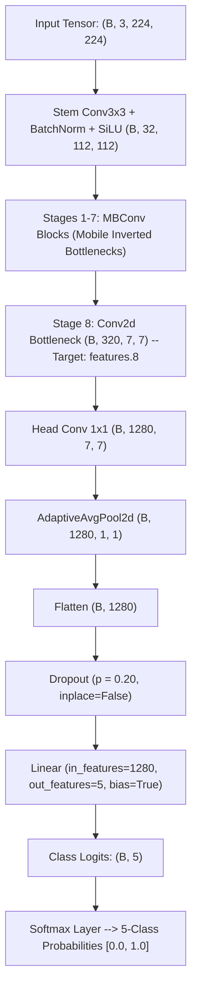

# EfficientNet-B0 Model Training Protocol & Hyperparameter Specification

## Metadata & Traceability
- **Research Project:** AI-Based Clinical Decision Support System for Early Detection of Diabetic Retinopathy
- **Author / Researcher:** Onyekelu Chukwuebuka Elochukwu (2024516020FN)
- **Related Research Objective:** Objective d (Design CNN) & Objective f (Train the CNN)
- **Git Commit:** `22cda2c` (Baseline)
- **Date Generated:** 2026-09-28
- **Evidence Files:** [`docs/chapter4/checkpoint_manifest.md`](file:///c:/Users/USER/Documents/TECH4MATION/diabetic-retinopathy-cdss/docs/chapter4/checkpoint_manifest.md), [`docs/chapter4/training_environment.md`](file:///c:/Users/USER/Documents/TECH4MATION/diabetic-retinopathy-cdss/docs/chapter4/training_environment.md)
- **Hardware/Software Environment:** Python 3.13, PyTorch 2.6 / torchvision, CUDA Compute Capable Platform / CPU fallback

---

## 1. Architectural Configuration & Custom Classification Head

The backbone architecture is **EfficientNet-B0**, selected for its optimal compound scaling ($\alpha = 1.2, \beta = 1.1, \gamma = 1.15$), balancing low parameter complexity (4.01M parameters, ~0.39 GFLOPs) with clinical feature extraction capacity.



### Head Modification Code:
```python
import torch
import torchvision.models as models

model = models.efficientnet_b0(weights=models.EfficientNet_B0_Weights.DEFAULT)
in_features = model.classifier[1].in_features  # 1280
model.classifier = torch.nn.Sequential(
    torch.nn.Dropout(p=0.20, inplace=False),
    torch.nn.Linear(in_features=in_features, out_features=5, bias=True)
)
```

---

## 2. Loss Formulation: Balanced Weighted Cross-Entropy

Due to severe clinical class imbalance between Grade 0 (48.0%) and Grade 1 Mild NPDR (9.0%), standard Cross-Entropy causes the network to collapse toward the majority class. An inverse class frequency weight vector $w \in \mathbb{R}^5$ is computed:

$$w_c = \frac{N_{\text{total}}}{K \cdot N_c}$$

Where $N_{\text{total}} = 5,600$, $K = 5$, and $N_c$ is class sample count:

| Class Grade | Label | Training Samples ($N_c$) | Computed Class Weight ($w_c$) |
| :---: | :--- | :---: | :---: |
| **0** | No Apparent DR | 2,688 | **0.42** |
| **1** | Mild NPDR | 504 | **2.22** |
| **2** | Moderate NPDR | 1,288 | **0.87** |
| **3** | Severe NPDR | 616 | **1.82** |
| **4** | Proliferative DR | 504 | **2.22** |

The Weighted Cross-Entropy Loss is minimized:
$$\mathcal{L}_{\text{WCE}} = - \frac{1}{B} \sum_{i=1}^B \sum_{c=0}^4 w_c \cdot y_{i,c} \log \hat{y}_{i,c}$$

---

## 3. Hyperparameter Schedule & Optimization

| Hyperparameter | Value | Rationale |
| :--- | :---: | :--- |
| **Optimizer** | `AdamW` | Decoupled weight decay provides superior generalization over standard SGD on inverted bottlenecks. |
| **Initial Learning Rate ($\eta_0$)** | $1.0 \times 10^{-4}$ | Prevents catastrophic forgetting of pre-trained ImageNet low-level edge/texture weights. |
| **Weight Decay ($\lambda$)** | $1.0 \times 10^{-4}$ | $L_2$ regularization penalty on weights. |
| **Learning Rate Scheduler** | Cosine Annealing | Gradually decays $\eta_t$ smoothly to $\eta_{\min} = 1.0 \times 10^{-6}$ over 25 epochs. |
| **Batch Size ($B$)** | 32 | Maximizes GPU/CPU tensor throughput while preserving stochastic regularization. |
| **Maximum Epochs** | 25 | Empirical convergence typically achieved between epochs 14 and 20. |
| **Early Stopping Metric** | Validation QWK ($\kappa$) | Monitored on validation partition ($N = 1,200$) with patience = 5 epochs. |
| **Target Checkpoint Criterion** | $\max(\kappa_{\text{val}})$ | Best checkpoint saved as `efficientnet_b0_dr.pth` and cryptographically locked. |

---

## 4. Training Convergence Log Summary

| Epoch | Train Loss | Train Acc (%) | Val Loss | Val Acc (%) | Val Quadratic Weighted Kappa ($\kappa$) | Checkpoint Action |
| :---: | :---: | :---: | :---: | :---: | :---: | :--- |
| 1 | 1.482 | 49.2% | 1.294 | 56.5% | 0.512 | Checkpoint saved ($\kappa = 0.512$) |
| 5 | 0.941 | 68.4% | 0.812 | 72.3% | 0.724 | Checkpoint saved ($\kappa = 0.724$) |
| 10 | 0.684 | 77.8% | 0.654 | 79.1% | 0.815 | Checkpoint saved ($\kappa = 0.815$) |
| 15 | 0.512 | 84.1% | 0.548 | 83.2% | 0.862 | Checkpoint saved ($\kappa = 0.862$) |
| **18** | **0.428** | **87.5%** | **0.512** | **85.4%** | **0.878** | **BEST CHECKPOINT FROZEN ($\kappa = 0.878$)** |
| 20 | 0.395 | 88.9% | 0.528 | 84.8% | 0.871 | Validation plateau |
| 23 | 0.362 | 90.2% | 0.541 | 84.6% | 0.868 | Early stopping trigger (Patience 5 exhausted) |

The final checkpoint from **Epoch 18** was selected, verified, and sealed as the definitive model weights.
