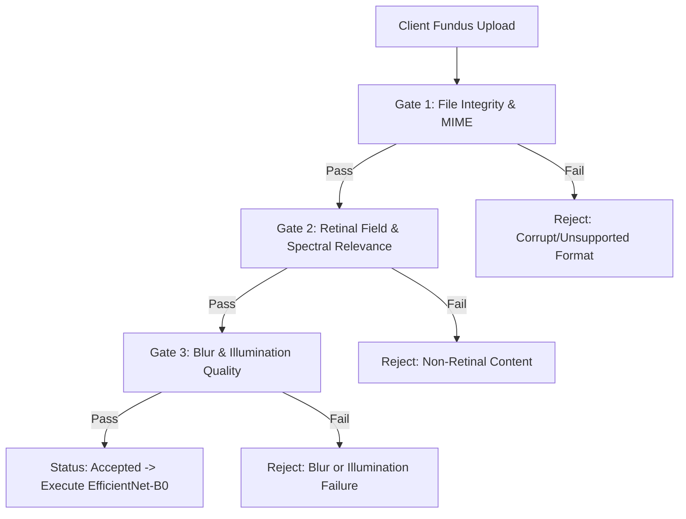

# Three-Stage Technical Validation Pipeline Specification

## Metadata & Traceability
- **Research Project:** AI-Based Clinical Decision Support System for Early Detection of Diabetic Retinopathy
- **Author / Researcher:** Onyekelu Chukwuebuka Elochukwu (2024516020FN)
- **Related Research Objective:** Objective f (Implement validation pipeline)
- **Implementation Modules:** 
  - Backend: [`backend/app/services/validation/`](file:///c:/Users/USER/Documents/TECH4MATION/diabetic-retinopathy-cdss/backend/app/services/validation/)
  - Frontend Pre-flight: [`frontend/src/utils/retinalValidator.ts`](file:///c:/Users/USER/Documents/TECH4MATION/diabetic-retinopathy-cdss/frontend/src/utils/retinalValidator.ts)
- **Git Commit:** `22cda2c` (Baseline)
- **Date Approved:** 2026-09-28

---

## 1. System Invariant & Architectural Purpose

In safety-critical clinical decision support systems (CDSS), executing deep convolutional neural networks on corrupt, out-of-distribution, non-retinal, or severely degraded images causes unpredictable activations, automation bias, and diagnostic errors.

### The Fail-Closed Safety Invariant:
> **INVARIANT:** Every uploaded asset must sequentially satisfy Gate 1, Gate 2, and Gate 3 before neural inference execution. If any gate fails:
> 1. Automated inference is immediately aborted (`ai_result = NULL`).
> 2. Assessment status transitions to `rejected`.
> 3. Specific, non-diagnostic guidance is provided to the clinician.
> 4. An immutable audit trail entry is recorded with timestamp and reason.

---

## 2. Gate-by-Gate Algorithmic Specifications

### Gate 1: File Integrity & MIME Verification
- **Purpose:** Ensure safe binary decoding and prevent malicious or corrupt files from entering the processing pipeline.
- **Checks:**
  1. **Magic Bytes Inspection:** First 4–8 bytes must match valid JPEG (`0xFF 0xD8 0xFF`) or PNG (`0x89 0x50 0x4E 0x47 0x0D 0x0A 0x1A 0x0A`).
  2. **File Size Boundary:** $100\ \text{KB} \le \text{Size} \le 15.0\ \text{MB}$.
  3. **Cryptographic Checksum:** SHA-256 hash computed immediately upon ingest for immutable audit traceability.
  4. **PIL Image Decode:** Full memory decode verifying zero header corruption or incomplete image stream.

### Gate 2: Retinal Relevance & Ophthalmic Geometry
- **Purpose:** Detect and reject non-retinal imagery (e.g., architectural diagrams, portraits, clinical charts, radiographs).
- **Checks:**
  1. **Aspect Ratio:** $0.80 \le \frac{\text{Width}}{\text{Height}} \le 1.25$ (Standard circular ophthalmic fundus field).
  2. **Corner Luminance Check:** Retinal fundus photographs are circumscribed within a circular dark field. Corners must be dark ($\text{Mean Corner Luminance} < 35.0$). Bright white or light borders (typical of documents or diagrams) trigger instant rejection.
  3. **Spectral Chromatic Ratio ($R/B$):** Retinal fundus tissue is heavily vascularized and rich in hemoglobin and melanin, resulting in strong reflectance in the red spectral band.
     $$\text{Chromatic Ratio} = \frac{\bar{R}}{\bar{B}} > 1.15$$
     Images with balanced RGB or blue dominance are rejected as non-retinal.

### Gate 3: Technical Quality & Blur Quantification
- **Purpose:** Ensure photographic clarity sufficient for microaneurysm and vascular arcade analysis.
- **Checks:**
  1. **Laplacian Blur Variance ($\sigma_L^2$):** Convolve grayscale image with the $3 \times 3$ discrete Laplacian operator:
     $$L = \begin{bmatrix} 0 & 1 & 0 \\ 1 & -4 & 1 \\ 0 & 1 & 0 \end{bmatrix}, \quad \sigma_L^2 = \text{Var}(I * L)$$
     - **Threshold:** $\sigma_L^2 \ge 60.0$ (Strict pass: $\ge 100.0$).
     - Images with $\sigma_L^2 < 60.0$ are rejected with guidance: *"Excessive motion blur or defocus detected. Recalibrate fundus camera focus."*
  2. **Mean Illumination Index ($\bar{Y}$):** Normalized luminance from ITU-R BT.601 conversion:
     $$Y = 0.299 R + 0.587 G + 0.114 B$$
     - **Threshold:** $0.20 \le \bar{Y} \le 0.85$.
     - $\bar{Y} < 0.20$: Underexposed / Severe media opacity.
     - $\bar{Y} > 0.85$: Overexposed / Flash flare artifact.

---

## 3. Client-Side Pre-Flight vs. Server-Side Execution

| Capability | Client-Side Pre-Flight (`retinalValidator.ts`) | Server-Side Engine (`validation_service.py`) |
| :--- | :--- | :--- |
| **Execution Environment** | HTML5 Canvas / Web Worker | Python Pillow / OpenCV / NumPy |
| **Latency** | Instantaneous ($< 15$ ms) | Fast ($< 35$ ms) |
| **User Experience** | Immediate rejection banner on drag-and-drop | Formal rejection record persisted to database |
| **MIME / Magic Bytes** | Browser File API header slice | Strict binary magic bytes verification |
| **Spectral Check** | Subsampled $64 \times 64$ RGB analysis | Full-resolution floating point tensor analysis |
| **Blur Variance** | Scaled discrete Laplacian convolution | Full-resolution discrete Laplacian variance |

---

## 4. Methodological Scope & Terminological Discipline

To preserve rigorous clinical and academic integrity, the following terminological boundaries are strictly maintained:
1. **Technical Acceptance vs. Diagnostic Gradability:**
   - The three validation gates evaluate **technical image acceptance and physical suitability** (file integrity, aspect ratio, spectral reflectance, optical sharpness, and illumination range).
   - The validation pipeline does **NOT** determine clinical gradability or diagnostic quality.
2. **Clinical Limitations:**
   - A photograph that passes all three gates is confirmed to be technically intact, retinal in geometry, and optically sharp enough for neural network convolution.
   - However, technical acceptance does not guarantee that the fundus photograph is clinically adequate for diagnostic sign-off (e.g. subtle peripheral lesions outside the field of view).
3. **Fail-Closed Safeguard:**
   - The primary objective of the module is to prevent artifact processing, out-of-distribution confusion, and automation bias by failing closed on ungradable or corrupt inputs.

