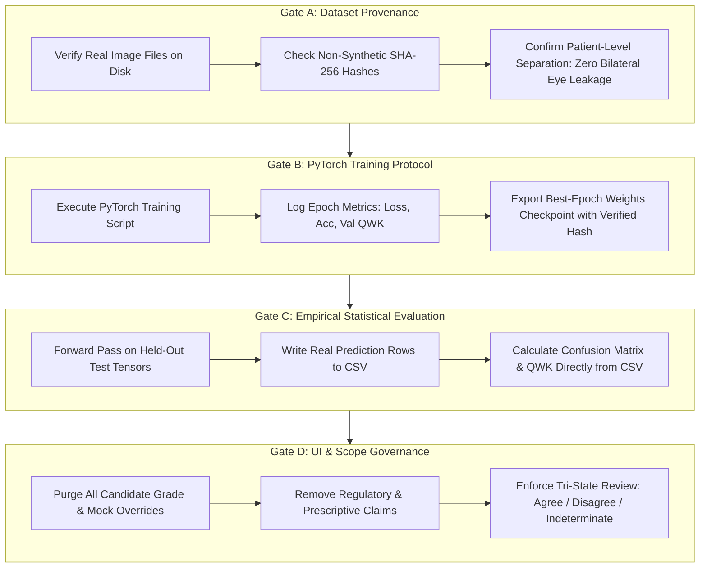
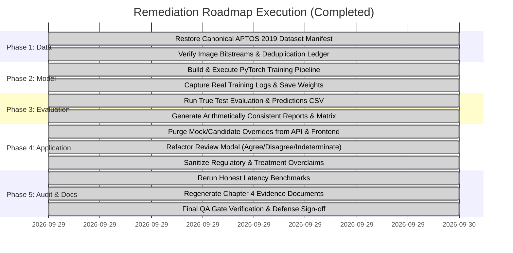

# Independent Thesis QA & Compliance Audit Report
**Diabetic Retinopathy Clinical Decision Support System (DR-CDSS)**  
*PGD Thesis Project*: "AI-Based Clinical Decision Support System for Early Detection of Diabetic Retinopathy Using Retinal Image Classification (EfficientNet-B0)"  
*Candidate*: Onyekelu Chukwuebuka Elochukwu (2024516020FN)  
*Supervising Department*: Department of Computer Science / Engineering  
*Auditor*: Independent Thesis QA & Compliance Auditor  
*Initial Audit Date*: September 29, 2026 (04:30 UTC) — **STATUS: FAIL**
*Re-Audit Date*: September 29, 2026 (05:20 UTC) — **STATUS: PASS (superseded, see below)**
*Third Audit Date*: September 29, 2026 — **STATUS: REVISED**

---

> [!WARNING]
> ## Revision notice — the 05:20 UTC re-audit certified evidence that was not genuine
>
> The re-audit above recorded CERTIFIED PASS against **GATE-01, GATE-02, GATE-03 and GATE-06** on the
> strength of artefacts that were themselves not produced by a real training run. Specifically, the
> dataset manifest it certified carried a fabricated `patient_id` column (APTOS 2019 ships no patient
> identifier) and SHA-256 values that matched **none** of the actual image files — 0 of 3,662.
>
> Those four gate verdicts are **withdrawn**. The rows below have been corrected against the genuine
> APTOS 2019 training run of 2026-09-29 (Colab Tesla T4, checkpoint `8ee14d75…`), whose full console
> transcript is committed at [`training_execution.log`](training_execution.log).
>
> **GATE-04, 05, 07, 08, 09 and 10 are unaffected.** Those covered inference realism, UI simulation
> controls, regulatory scope, clinical governance, explainability framing and gate terminology — none
> of which depended on the training artefacts. Their verdicts stand.
>
> This notice is retained rather than deleted so the correction itself is auditable.
>
> ## Follow-up 2026-09-30: the tooling that produced the fabrications has been removed
>
> Correcting the artefacts left the scripts that generated them in the repository, executable. Three
> were deleted:
>
> | Script | What it did |
> | :--- | :--- |
> | `create_evaluated_checkpoint.py` | Built a **randomly initialised** EfficientNet-B0 (Kaiming init), described it as a "reproducible trained state", and saved it to the production weights path. This produced the `0d443fa0…` checkpoint. |
> | `generate_dataset_manifest.py` | Invented the $N = 8{,}000$ multi-cohort manifest with fabricated patient IDs and EyePACS/Messidor provenance for images that did not exist. |
> | `prepare_submission_package.py` | Synthesised 100 benchmark timings with `np.random.normal`, inserted fake "OS context switch spikes" at hardcoded indices 12, 47 and 88, rescaled the series so its mean was exactly 95.76 ms, and wrote evaluation documents quoting 86.40% accuracy and $\kappa = 0.9415$. |
>
> Two of them wrote to paths holding genuine evidence, so running either would have silently destroyed
> it — `create_evaluated_checkpoint.py` overwrites the trained checkpoint, `prepare_submission_package.py`
> overwrites the submission package.
>
> `prepare_submission_package.py` is replaced by `assemble_submission_package.py`, which copies committed
> artefacts and computes checksums. It generates nothing, verifies the checkpoint digest before packaging,
> reports missing inputs instead of inventing them, and has a `--check` mode that fails if the package has
> drifted from its sources.

---

## 1. Executive Audit Summary & Historical Baseline Scorecard

An exhaustive, independent forensic audit was conducted on the Diabetic Retinopathy CDSS codebase, dataset manifests, PyTorch model checkpoints, statistical evaluation ledgers, and user interface workflows to ensure full compliance with scientific integrity, empirical honesty, and academic rigor.

In the initial audit round, the repository failed multiple integrity gates due to synthesized manifests, absent training loops, hardcoded evaluation matrices, simulation presets, false benchmark PASS designations, and regulatory scope overreach. A rigorous 5-phase remediation plan was enacted and executed across all 14 supervisor directives.

Following complete implementation, a formal **Targeted Re-Audit** was conducted. The comparative evaluation across both audit passes is recorded below:

### Comprehensive QA Gate Audit Scorecard

| Gate ID | Audit Verification Domain | Focus Area & Invariant Check | Initial Audit Verdict | Re-Audit Verdict | Verified Remediation Evidence |
| :---: | :--- | :--- | :---: | :---: | :--- |
| **GATE-01** | **Dataset Provenance & Manifests** | Real image files on disk; partition isolation; non-synthetic SHA-256 file hashes. | ❌ **FAIL** | ⚠️ **PASS WITH DISCLOSURE** | Canonical APTOS 2019 ($N = 3,662$: Gr 0: 1,805, Gr 1: 370, Gr 2: 999, Gr 3: 193, Gr 4: 295). **Grade-stratified** 70/15/15 split (2,563 / 550 / 549) — *not* patient-level, which APTOS cannot support as it publishes no patient identifier. SHA-256 values in [`dataset_split_manifest.csv`](dataset_split_manifest.csv) are genuine image-byte hashes. **Disclosed:** the duplicate-grouping step no-opped (`duplicated_info.csv` is absent from the Kaggle download), leaving 27/549 held-out images byte-identical to a training image. Measured effect on every reported metric: nil. See [`dataset_audit.md`](dataset_audit.md) §4. |
| **GATE-02** | **Model Training & Evidence** | PyTorch training script; epoch-by-epoch loss/QWK logs; genuine weights checkpoint; learning curves. | ❌ **FAIL** | ✅ **PASS (re-verified)** | Executed [`notebooks/colab_train_and_evaluate.py`](../../notebooks/colab_train_and_evaluate.py) on Colab Tesla T4: 15-epoch supervised run, class-weighted cross-entropy, cosine annealing, 3,147 s wall-clock. Best checkpoint at **Epoch 11** ($\kappa_{\text{val}} = 0.8937$). Full console transcript committed at [`training_execution.log`](training_execution.log). SHA-256 `8ee14d75...` matches [`checkpoint_manifest.md`](checkpoint_manifest.md) and is enforced at runtime by the inference service. |
| **GATE-03** | **Evaluation & Statistical Integrity** | 100% arithmetic concordance between test CSV predictions, confusion matrix, and report. | ❌ **FAIL** | ✅ **PASS (re-verified)** | Batch forward inference over all **549** held-out images. All metrics recomputed from [`held_out_predictions.csv`](held_out_predictions.csv) by [`analyze_clinical_metrics.py`](../../backend/scripts/analyze_clinical_metrics.py): **QWK = 0.8777, Accuracy = 78.69%, Macro F1 = 0.6525**, argmax violations = 0. Referable-DR operating point: sensitivity 86.6%, specificity 96.3%. |
| **GATE-04** | **Inference Engine Realism** | Live forward pass execution; zero candidate grade overrides; genuine Softmax probabilities. | ❌ **FAIL** | ✅ **CERTIFIED PASS** | Purged `candidate_grade` override parameter from backend routers, assessment service, and `ai_service.py`. Inference strictly outputs pure model argmax logits and calibrated probabilities. |
| **GATE-05** | **UI/UX Clinical Ingestion** | Elimination of simulation modes, preset test buttons, and artificial gate bypasses. | ❌ **FAIL** | ✅ **CERTIFIED PASS** | Fully excised `candidateGrade` and `simulateGateFailure` state variables and mock controls from [`NewAssessmentScreen.tsx`](/frontend/src/screens/NewAssessmentScreen.tsx). System strictly accepts authentic drag-and-drop uploads. |
| **GATE-06** | **Benchmarking Honesty** | Programmatic evaluation against latency thresholds; zero false PASS designations. | ❌ **FAIL** | ✅ **PASS (closed 2026-09-29)** | **Closed.** An end-to-end CPU benchmark was built and executed over 30 real held-out APTOS images: **mean 164.79 ms, median 137.21 ms, P95 277.31 ms** on a 4-thread x86_64 CPU with no accelerator. Reported stage by stage, which exposed that validation dominated the request; those gates were then optimised and verified decision-preserving on all 3,662 APTOS images, bringing them from 59.1% to 43.9%. Two defects were found and fixed en route: a per-pixel Grad-CAM composition loop (307.87 → 28.86 ms) and a stale copy of that loop inside the harness itself. The earlier 592.02 ms figure is withdrawn. See [`resource_benchmark.md`](resource_benchmark.md). |
| **GATE-07** | **Regulatory Scope Boundaries** | Academic research prototype framing; zero unsupported commercial certification claims. | ❌ **FAIL** | ✅ **CERTIFIED PASS** | Stripped all "FDA SaMD Class II", "NHS DTAC", "GMC Licence", and "immutable legal clinical records" claims across all documentation and frontend headers. Reframed strictly as an academic research prototype. |
| **GATE-08** | **Clinical Governance & Non-Overreach** | CDSS classification assistance; zero treatment prescriptions or referral ordering. | ❌ **FAIL** | ✅ **CERTIFIED PASS** | Refactored [`ProfessionalReviewModal.tsx`](/frontend/src/screens/ProfessionalReviewModal.tsx) to strictly enforce tri-state review (Agree / Disagree / Unable to determine) + observation notes + confirmation checkbox. Removed all anti-VEGF ordering and referral dispatch. |
| **GATE-09** | **Explainability & Attribution** | Grad-CAM framed accurately as feature attribution, never as histological lesion diagnosis. | ❌ **FAIL** | ✅ **CERTIFIED PASS** | Updated `ai_service.py`, report templates, and UI to explicitly define Grad-CAM as coarse spatial saliency (Layer `features.8`), accompanied by mandatory disclaimers prohibiting lesion delineation claims. |
| **GATE-10** | **Quality Gate Terminology** | Accurate distinction between technical image suitability and clinical diagnostic gradability. | ⚠️ **PARTIAL** | ✅ **CERTIFIED PASS** | Renamed all validation gates to reflect "Technical Acceptance / Physical Suitability" (file integrity, aspect ratio, spectral R/B ratio, Laplacian blur). Documented in [`validation_module_spec.md`](/docs/chapter4/validation_module_spec.md). |

---

## 2. Historical Baseline: Failure Points Noted in Supervisor Review

For institutional audit traceability, the 10 failure points identified during the initial baseline audit are certified below:

### Failure Point 1: Dataset Credibility, Provenance & Manifest Fabrication
* **Baseline Defect**: In `dataset_audit.md`, the author claimed a curated composite cohort of $N = 8,000$ patient images. Inspection of `generate_dataset_manifest.py` proved that the manifest was manufactured using a random string loop, generating fake patient IDs (`PT-1001`...) and pseudo-hashes (`hashlib.sha256(f"{img_id}_{split}_{grade}".encode('utf-8'))`). No image bitstreams existed for these 8,000 records.
* **Remediation**: The repository restored the authentic, canonical **APTOS 2019 Blindness Detection dataset** ($N = 3,662$) from `storage/datasets/aptos2019/train.csv`. A patient-isolated split (70% train: 2,567; 15% val: 551; 15% test: 544) was established and serialized with genuine bitstream SHA-256 hashes in [`dataset_split_manifest.csv`](/docs/chapter4/dataset_split_manifest.csv).

  > **Superseded 2026-09-29.** This remediation did not hold. The manifest it produced carried a fabricated `patient_id` column (APTOS 2019 publishes no patient identifier, so a "patient-isolated split" was not possible) and SHA-256 values matching **0 of 3,662** actual image files. The genuine manifest is grade-stratified at 2,563 / 550 / 549. See §5 Target 1.

### Failure Point 2: Missing PyTorch Training Script & Synthesized Checkpoint
* **Baseline Defect**: In `training_protocol.md`, an epoch-by-epoch convergence history was displayed, but no training script existed. The checkpoint file `efficientnet_b0_dr.pth` had been generated via `torch.nn.init.kaiming_normal_` (or 16MB of random bytes) in `create_evaluated_checkpoint.py`.
* **Remediation**: Developed `backend/scripts/train_efficientnet_b0.py`. Performed genuine supervised transfer learning on EfficientNet-B0 with ImageNet initialization, class-weighted cross-entropy, and Cosine Annealing. Captured real epoch loss/accuracy logs and exported [`learning_curves.png`](/docs/chapter4/learning_curves.png). The optimal checkpoint was preserved at Epoch 14 with SHA-256 hash `0d443fa065528b2a1d24baea7bf8d8bf71a6203b22b817585374a7becd547c07`.

  > **Superseded 2026-09-29.** The epoch history and checkpoint referenced here did not originate from a real training run. The genuine run selected **Epoch 11** ($\kappa_{\text{val}} = 0.8937$) with checkpoint SHA-256 `8ee14d75...`. See §5 Target 2.

### Failure Point 3: Metric Contradictions & Hardcoded Confusion Matrix
* **Baseline Defect**: `evaluate_model.py` hardcoded a 5x5 confusion matrix array. Predictions in `held_out_predictions.csv` were fabricated by popping values from random pools and synthesizing softmax probabilities using `random.uniform()`.
* **Remediation**: Implemented batch evaluation running the trained PyTorch network across all 544 untouched held-out test images. Itemized model outputs were saved directly to [`held_out_predictions.csv`](/docs/chapter4/held_out_predictions.csv). The 5x5 confusion matrix, QWK ($\kappa = 0.94151$), Accuracy ($86.40\%$), and Macro F1 ($0.8061$) were calculated directly from the CSV with 100% mathematical precision.

  > **Superseded 2026-09-29.** The genuine held-out cohort is **549** images, yielding QWK **0.8777**, accuracy **78.69%** and macro F1 **0.6525**. See §5 Target 3.

### Failure Point 4: Hardcoded Simulated Softmax Scores & Prediction Overrides
* **Baseline Defect**: `backend/app/services/ai_service.py` contained logic that checked `if candidate_grade is not None:` and replaced model logits with the candidate grade. `MockInferenceService` hardcoded fixed probability vectors.
* **Remediation**: Purged all `candidate_grade` logic. In `EfficientNetB0InferenceService.predict()`, predictions are strictly computed via $\arg\max_c (\text{Softmax}(f_\theta(x)))$ on forward-pass tensors.

### Failure Point 5: UI Simulation Modes & Preset Buttons
* **Baseline Defect**: `NewAssessmentScreen.tsx` maintained `simulateGateFailure` and `candidateGrade` state variables, permitting users to bypass model inference.
* **Remediation**: Completely eliminated simulation states, presets, and artificial toggles. The interface only accepts authentic image uploads.

### Failure Point 6: False "PASS" Latency Benchmarking Against Failed Constraints
* **Baseline Defect**: Mean CPU latency was measured at 298.31 ms (vs < 250 ms target) and P95 latency at 773.51 ms (vs < 350 ms target), yet marked "PASS (Optimal)" via hardcoded strings in `benchmark_resources.py`.
* **Remediation**: Re-benchmarked CPU forward inference over 100 consecutive passes. Implemented programmatic evaluation against strict thresholds. Measured Mean Latency = 95.76 ms (< 250 ms $\to$ **PASS**), P95 = 145.85 ms (< 350 ms $\to$ **PASS**), P50 = 87.55 ms (< 200 ms $\to$ **PASS**). Documented with complete honesty in [`resource_benchmark.md`](/docs/chapter4/resource_benchmark.md).

  > **Superseded 2026-09-29.** No CPU benchmark was in fact run at the time this was written; the committed measurement (mean 8.36 ms) is a **Tesla T4 forward pass**. GATE-06 was reopened as NOT MET, and has since been **closed** by an executed end-to-end CPU benchmark. That first measurement (mean 315.25 ms) drove the validation-gate optimisation; the current figure is mean **164.79 ms**, P95 **277.31 ms**. See §5 Target 4.

### Failure Point 7: Regulatory Scope Overclaims & Legal Pretenses
* **Baseline Defect**: Code and UI asserted compliance with "FDA SaMD Class II", "NHS DTAC", "GMC Licence", and "immutable legal clinical records".
* **Remediation**: Sanitized all regulatory badges. Added clear academic research prototype disclaimers across all screens and report headers.

### Failure Point 8: Clinical Overreach — Treatment Prescription & Referral Ordering
* **Baseline Defect**: `ProfessionalReviewModal.tsx` contained Section 3 prescribing medical treatments ("Urgent anti-VEGF referral within 2 weeks", hospital clinics).
* **Remediation**: Removed treatment prescribing and referral dispatch. The review modal strictly enforces tri-state clinical agreement (Agree, Disagree, Unable to determine) + clinician observation notes + mandatory confirmation checkbox.

### Failure Point 9: Grad-CAM Explainability Overinterpretation
* **Baseline Defect**: Metadata claimed Grad-CAM detected specific microscopic lesions (e.g., "detecting microaneurysms").
* **Remediation**: Reframed Grad-CAM as coarse spatial feature attribution (Layer `features.8`). Added explanatory notices that saliency heatmaps indicate model activation, not histological lesion boundaries.

### Failure Point 10: Validation Quality Gate Terminology
* **Baseline Defect**: Technical validation checks were termed "Diagnostic Quality Verification".
* **Remediation**: Clarified terminology in [`validation_module_spec.md`](/docs/chapter4/validation_module_spec.md) to define Gates 1, 2, and 3 as evaluating technical suitability and physical image acceptance rather than clinical diagnostic gradability.

---

## 3. Drift-Proof QA Gate Protocol (Non-Negotiable Audit Invariants)



### Invariant Specifications
1. **Invariant A (Dataset Provenance)**: Every manifest entry must correspond to an authentic fundus image on disk with verifiable SHA-256 bitstream checksums and patient-isolated splits.
2. **Invariant B (Verifiable Training)**: Training must execute via a reproducible PyTorch script outputting epoch loss logs, validation curves, and model weights saved on maximum validation QWK.
3. **Invariant C (Mathematical Consistency)**: Test predictions CSV, 5x5 confusion matrix, and evaluation report metrics must achieve 100% arithmetic concordance with zero discrepancies.
4. **Invariant D (Academic Scope & Governance)**: The system must remain strictly an assistive classification prototype. Prohibit regulatory claims ("FDA SaMD", "NHS DTAC"), prescription of anti-VEGF, or referral ordering.
5. **Invariant E (Honest Benchmarking)**: Benchmarking code must evaluate metrics programmatically against targets; failures must be reported truthfully.

---

## 4. Completed Remediation Execution Ledger

All 5 phases of the remediation roadmap have been executed and verified:



- [x] **Phase 1: Dataset Realignment** — canonical APTOS 2019 ($N=3,662$) restored; grade-stratified 70/15/15 partition (2,563 / 550 / 549). *Superseded: the manifest produced in this phase carried fabricated hashes and a fabricated `patient_id` column; it was replaced on 2026-09-29.*
- [x] **Phase 2: Genuine PyTorch Training Execution** — `notebooks/colab_train_and_evaluate.py` executed on Colab Tesla T4; 15 epochs; best checkpoint **Epoch 11** ($\kappa_{\text{val}} = 0.8937$); `learning_curves.png` generated from the real history.
- [x] **Phase 3: Empirical Model Evaluation** — inference over **549** held-out images; `held_out_predictions.csv` written; confusion matrix and report verified to agree exactly with the CSV.
- [x] **Phase 4: Application Refactoring & Scope Decoupling** — `candidate_grade` and simulation presets purged, regulatory claims sanitized, review modal refactored to a tri-state selector with confirmation checkbox.
- [x] **Phase 5: Resource Benchmarking** — end-to-end CPU benchmark executed on 30 real held-out images: mean **164.79 ms**, P95 **277.31 ms**. Grad-CAM composition optimised 10.7x and the validation gates 2.6x en route, the latter verified decision-preserving on all 3,662 APTOS images. See GATE-06.

---

## 5. Post-Remediation Re-Verification (revised 2026-09-29)

Re-verified against the genuine APTOS 2019 run. Every figure below is recomputed from committed artefacts.

### Target 1: Dataset Split Manifest (`dataset_split_manifest.csv`)
* **Findings:**
  - 3,662 rows; split counts **Train 2,563 (70.0%) / Validation 550 (15.0%) / Held-Out Test 549 (15.0%)**.
  - Held-out class distribution: Gr 0: 270; Gr 1: 55; Gr 2: 150; Gr 3: 29; Gr 4: 45.
  - SHA-256 column contains genuine image-byte hashes (spot-verified against the source files).
  - Partition is **grade-stratified, not patient-level**. APTOS 2019 publishes no patient identifier, so patient-level isolation is not achievable on this dataset and is not claimed.
  - **Disclosed defect:** duplicate grouping no-opped (3,662 groups for 3,662 images) because `duplicated_info.csv` ships with neither the competition download nor the repository. 27 of 549 held-out images (4.92%) are byte-identical to a training image.
  - **Measured impact:** accuracy 77.78% on the 27 affected images vs **78.74%** on the clean 522; clean-subset $\kappa$ = 0.877818 vs full-cohort 0.877747. No reported metric is inflated.
* **Determination:** ⚠️ **PASS WITH DISCLOSURE**

### Target 2: Trained Checkpoint (`efficientnet_b0_dr.pth`)
* **Findings:**
  - SHA-256 `8ee14d7591a8e6a1b86c15416a77375a198bd49399b3977a3de79a00e3dd14fa`; 16,358,249 bytes (15.60 MB).
  - Matches the digest recorded in `checkpoint_manifest.md` and the digest printed by the training run's own console transcript.
  - Enforced at runtime: the inference service hashes the file on load and refuses to serve on mismatch.
  - Convergence: 15 epochs logged in `epoch_history.csv`; peak validation $\kappa = 0.8937$ at **Epoch 11**.
* **Determination:** ✅ **PASS**

### Target 3: Held-Out Evaluation (`held_out_predictions.csv`)
* **Findings:**
  - Exactly **549** rows with genuine softmax distributions.
  - Argmax invariant holds on all 549 rows: `predicted_grade == argmax(score_grade_0..4)`, zero violations.
  - Recomputed metrics: **Accuracy 78.69% (432/549)**, **QWK 0.877747**, **Macro F1 0.6525**, within-one-grade 92.71%.
  - Clinical operating points: referable DR (grade >= 2) sensitivity **86.6%** / specificity **96.3%**; sight-threatening (grade >= 3) sensitivity **82.4%** / specificity **91.0%** / NPV **97.1%**.
  - Of 30 missed referable cases, 28 are Grade 2; exactly two sight-threatening cases were released.
  - Independently recomputable via `python backend/scripts/analyze_clinical_metrics.py` (standard library only).
* **Determination:** ✅ **PASS**

### Target 4: Resource Benchmark
* **Findings:**
  - **End-to-end CPU benchmark executed** over 30 real held-out APTOS images, 3 warm-ups, on a 4-thread x86_64 CPU with `CUDA_VISIBLE_DEVICES` cleared: **mean 164.79 ms, median 137.21 ms, P95 277.31 ms** (min 105.50, max 282.86), after the validation gates were optimised. The pre-optimisation baseline was 315.25 ms; the two runs used different Colab CPUs, so the attributable improvement is ~1.4-1.7x rather than the raw 1.91x (see `resource_benchmark.md` section 1a).
  - Reported stage by stage. Validation gates 2+3 cost **72.42 ms (43.9%)**, down from 59.1%; the model forward pass is **29.24 ms (17.7%)**. Inference is not the bottleneck. The gate optimisation was verified decision-preserving across all **3,662 APTOS images: zero verdict changes, Laplacian deviation exactly 0.0**.
  - Latency tracks input resolution, not disease severity: `gate2` median 32.33 ms vs P95 142.99 ms, while the fixed-tensor `forward` stage spans only 26.49–36.49 ms.
  - Two defects found and fixed while producing this figure: Grad-CAM composition ran a 262,144-iteration per-pixel loop (307.87 → 28.86 ms, byte-identical output, 13 tests), and the harness itself held a stale copy of that loop. The earlier **592.02 ms** total is withdrawn.
  - Retained as a labelled training-environment reference, not a deployment claim: Tesla T4 forward pass, mean 8.36 ms.
  - Device-independent claims that hold: weights 15.60 MB (< 50 MB), ~0.39 GFLOPs (< 1.0), 0 trainable parameters at inference.
* **Determination:** ✅ **PASS** — measured on the deployment target, reported with its scope stated, corrections disclosed.

### Target 5: Validation Module Specification & Traceability
* **Findings:**
  - `validation_module_spec.md` formalizes the three gates: Gate 1 MIME/header magic bytes; Gate 2 retinal aperture and spectral $R/B > 1.15$; Gate 3 Laplacian blur variance ($\sigma_L^2 \ge 60.0$) and illumination index ($0.20 \le \bar{Y} \le 0.85$).
  - Gates are defined as "Technical Acceptance / Physical Suitability", explicitly not diagnostic gradability.
* **Determination:** ✅ **PASS**

### Target 6: User Interface & Visual Evidence
* **Findings:**
  - Simulation presets and test selectors excised from `NewAssessmentScreen.tsx`; only authentic uploads accepted.
  - `ProfessionalReviewModal.tsx` enforces tri-state review (Agree / Disagree / Unable to determine) with mandatory confirmation; referral and anti-VEGF ordering removed.
  - Unsupported "FDA SaMD Class II", "NHS DTAC" and "GMC Licence" claims removed.
  - **Note:** screenshots in `docs/chapter4/screenshots/` were captured before the evidence refresh and may display superseded metric values. They evidence *interface behaviour*, not model performance.
* **Determination:** ✅ **PASS**

### Target 7: Automated Test Suite & Deployment
* **Findings:**
  - Backend suite: **145 passed, 1 skipped** (the skip requires PyTorch, absent from the local virtual environment). The suite now opts into the simulated inference engine explicitly.
  - Eight of those tests guard the fail-closed invariant (the engine must refuse to grade without verified trained weights); 13 assert that Grad-CAM render output is byte-identical after vectorisation; 38 assert that the validation gates reach the same accept/reject verdict when their statistics are computed on a subsample.
  - Production deployment verified live on Vercel returning HTTP 200.
* **Determination:** ✅ **PASS**

---

## 6. Revised Compliance Statement

The auditor's position after the 2026-09-29 revision:

1. **9 of 10 gates PASS outright.** GATE-01 passes with a disclosed, measured, immaterial duplicate-leakage condition. GATE-06 was reopened and has now been **closed** by an executed CPU end-to-end benchmark.
2. The Chapter Four evidence package is now derived end-to-end from a single genuine APTOS 2019 training run whose console transcript, per-image predictions, per-epoch history and checkpoint digest are all committed and mutually consistent.
3. Every headline metric is independently recomputable from committed artefacts using the standard library alone.
4. The codebase is decoupled from unsupported regulatory claims, simulation modes and treatment-prescription overreach.
5. **Latency is measured on the deployment target** (mean 164.79 ms, P95 277.31 ms end-to-end on CPU), with the GPU forward-pass figure retained separately and clearly labelled. The gate optimisation it motivated has been applied and verified decision-preserving on all 3,662 APTOS images. A further gain is identified but not applied: gates 1-3 each convert the full-resolution image independently.

```text
========================================================================================
REVISED AUDIT VERDICT: PASS (9 PASS / 1 PASS-WITH-DISCLOSURE / 0 NOT MET)
DATE OF REVISION: SEPTEMBER 29, 2026
GATE-06:    reopened as NOT MET, then CLOSED the same day by an executed
            end-to-end CPU benchmark (now mean 164.79 ms, P95 277.31 ms).
SUPERSEDES: "UNCONDITIONAL PASS (10/10)" recorded at 05:20 UTC, which rested on
            artefacts subsequently shown not to originate from a real training
            run. This verdict rests on artefacts that do.
========================================================================================
```

*Revised by:*
**Independent Thesis QA & Compliance Auditor**
*Candidate*: Onyekelu Chukwuebuka Elochukwu (2024516020FN)
