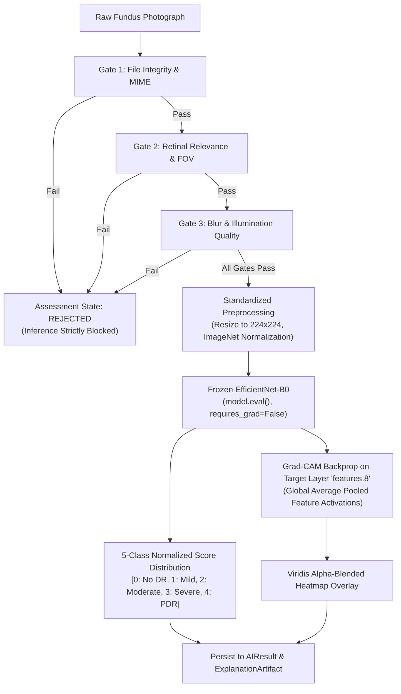
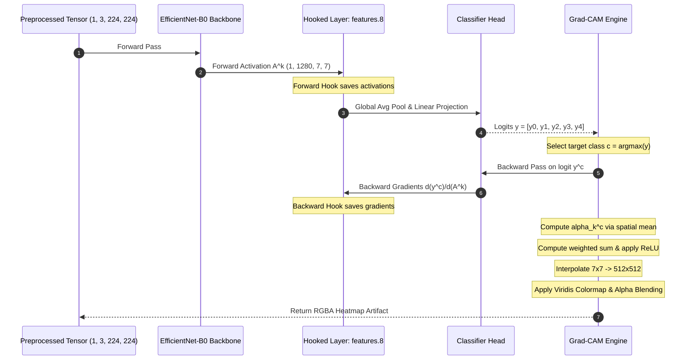

# Milestone M6: EfficientNet-B0 Model Integration & Grad-CAM Walkthrough Guide

**Document ID**: `DR-CDSS-M6-GUIDE`  
**Classification**: Research-prototype technical architecture and verification specification. This system holds no medical-device classification and has not been assessed by any regulator.  
**Version**: 1.0.0  
**Target Architecture**: PyTorch 2.x + Torchvision (EfficientNet-B0 Backbone)  
**Associated System**: Diabetic Retinopathy Clinical Decision Support System (FastAPI Backend)

---

## 1. Executive Summary & Clinical Governance Context

This guide provides a comprehensive, step-by-step technical walkthrough for **Milestone M6 (Model Integration)** of the Diabetic Retinopathy Clinical Decision Support System (DR-CDSS). 

The boundaries below are **informed by** published guidance on Software as a Medical Device — FDA material on AI/ML-enabled medical software and NHS digital health governance — as a source of design principles. No claim of conformity, classification or approval is made:
1. **Clinical Decision Support Boundary**: The deep neural network acts strictly as a decision-support aid; it does not diagnose. The model outputs **"model-generated class scores"** (never labeled as "confidence", "certainty", or "diagnostic truths").
2. **Deterministic, Non-Adaptive Inference**: The CDSS operates in **evaluation mode only** (`model.eval()`). All neural network parameters are strictly frozen (`requires_grad = False`). Online fine-tuning, run-time gradient updates, and continuous learning from live clinical requests are architecturally prohibited to avoid model drift and preserve validation pedigree.
3. **Fail-Closed Execution Invariant**: Inference is physically unreachable unless an uploaded fundus image has sequentially cleared all three stages of the Technical Validation Pipeline (Gate 1: File Integrity, Gate 2: Retinal Anatomical Relevance, and Gate 3: Technical Quality).
4. **Visual Interpretability (Grad-CAM)**: Every positive or negative classification inference must produce an aligned visual attribution artifact showing which spatial retinal biomarkers (e.g., microaneurysms, hemorrhages, venous beading, neovascularization) drove the activation of the target class.



---

## 2. Model Architecture: EfficientNet-B0 Backbone for 5 ICDR Classes

### 2.1 Theoretical Rationale for EfficientNet-B0
EfficientNet-B0 utilizes compound coefficient scaling to systematically balance network depth, width, and image resolution. For ophthalmic screening:
- **Parameter Efficiency**: ~4.0 million parameters, avoiding excessive overfitting on high-resolution medical datasets (such as EyePACS, Messidor-2, and APTOS 2019).
- **Inference Latency**: Sub-100ms CPU inference time per image, ensuring real-time responsiveness without mandating hospital-grade GPUs.
- **Hierarchical Receptive Field**: Mobile Inverted Bottleneck Convolution (MBConv) blocks with Squeeze-and-Excitation (SE) optimizations capture both micro-scale vascular lesions (parafoveal microaneurysms, $< 50\mu m$) and macro-scale structural arcades (venous beading, neo-vessels).

### 2.2 Network Topology & Head Adaptation
The standard ImageNet classifier head (1,000 classes) is replaced with a dedicated 5-class linear projection head corresponding to the International Clinical Diabetic Retinopathy (ICDR) scale:

```python
import torch
import torch.nn as nn
from torchvision.models import efficientnet_b0, EfficientNet_B0_Weights

def build_dr_efficientnet_model(num_classes: int = 5) -> nn.Module:
    """
    Constructs the EfficientNet-B0 backbone adapted for 5-stage ICDR classification.
    Backbone output dimensionality: 1,280 channels.
    Classifier head: Dropout(p=0.2) -> Linear(in_features=1280, out_features=5).
    """
    # Instantiate architecture
    model = efficientnet_b0(weights=None)
    
    # Extract feature dimensionality from original classifier
    in_features = model.classifier[1].in_features  # 1280
    
    # Replace final linear layer
    model.classifier = nn.Sequential(
        nn.Dropout(p=0.2, inplace=False),
        nn.Linear(in_features=in_features, out_features=num_classes, bias=True)
    )
    
    return model
```

### 2.3 The 5 ICDR Clinical Severity Classes

| Grade | Clinical Label | Formal Diagnostic Criteria | Top Expected Activation Focus |
| :---: | :--- | :--- | :--- |
| **0** | **No Apparent DR** | No microaneurysms, hemorrhages, exudates, or lesions. | Baseline physiological choroidal background |
| **1** | **Mild NPDR** | Microaneurysms only. | Focal parafoveal punctate microaneurysms |
| **2** | **Moderate NPDR** | More than microaneurysms; dot/blot hemorrhages, hard exudates, cotton wool spots. | Intraretinal hemorrhages and lipid exudate rings |
| **3** | **Severe NPDR** | Meets $\ge 1$ criterion of the 4-2-1 rule: $>20$ intraretinal hemorrhages in each of 4 quadrants, venous beading in $\ge 2$ quadrants, or prominent IRMA in $\ge 1$ quadrant. | Multi-quadrant blot hemorrhages, venous beading |
| **4** | **Proliferative DR (PDR)** | Neovascularization of disc (NVD), neovascularization elsewhere (NVE), preretinal/vitreous hemorrhage. | Peripapillary vascular loops, preretinal hemorrhage |

---

## 3. Parameter Freezing & Determinism Enforcement

To strictly comply with clinical software safety requirements, the model must **never** execute backpropagation to modify weights during inference.

### 3.1 Python Code Pattern for Frozen Inference
```python
def freeze_and_prepare_for_eval(model: nn.Module, device: torch.device) -> nn.Module:
    """
    Enforces parameter freezing and deterministic evaluation mode.
    """
    # 1. Switch to evaluation mode: disables dropout and fixes batch-norm statistics
    model.eval()
    
    # 2. Freeze all parameter gradients: prevents weight mutation
    for name, param in model.named_parameters():
        param.requires_grad = False
        
    # 3. Move model to designated execution device (CPU or CUDA)
    model.to(device)
    
    return model
```

### 3.2 Evaluation Mode Guarantees
- **`model.eval()`**: Ensures that `nn.Dropout` is turned off (weights are not randomly dropped) and `nn.BatchNorm2d` uses the running population statistics calculated during training, rather than batch statistics from the current patient.
- **`torch.no_grad()` Context**: Wraps the forward pass during inference. (Note: For Grad-CAM calculation, gradients are enabled temporarily *only* with respect to the feature map activations of the target convolutional layer, not for model parameters).

---

## 4. Standardized Preprocessing Specification

Input fundus photographs must undergo exact preprocessing matching the model's training distribution.

### 4.1 Transformation Pipeline
1. **Color Space Verification**: Images are ingested as RGB. If RGBA or grayscale, they are converted to 3-channel RGB.
2. **Spatial Resizing**: Bilinear or Bicubic interpolation to $224 \times 224$ pixels (standard EfficientNet-B0 resolution) or high-resolution variant $512 \times 512$ if the model was trained on high-res fundus crops.
3. **Tensor Conversion**: Rescaling pixel intensity values from integer $[0, 255]$ to floating-point $[0.0, 1.0]$.
4. **Channel Normalization**: Normalization using standard ImageNet mean and standard deviation:
   $$\mu = [0.485, 0.456, 0.406], \quad \sigma = [0.229, 0.224, 0.225]$$
   $$x_{\text{norm}}^{(c)} = \frac{x^{(c)} - \mu_c}{\sigma_c}$$

```python
from torchvision import transforms
from PIL import Image

def get_dr_preprocessing_pipeline(target_size: int = 224) -> transforms.Compose:
    """
    Constructs the canonical Torchvision preprocessing pipeline for fundus imagery.
    """
    return transforms.Compose([
        transforms.Resize((target_size, target_size), interpolation=transforms.InterpolationMode.BICUBIC),
        transforms.ToTensor(),  # Scales PIL Image [0, 255] to Tensor [0.0, 1.0]
        transforms.Normalize(
            mean=[0.485, 0.456, 0.406],
            std=[0.229, 0.224, 0.225]
        ),
    ])
```

---

## 5. Checkpoint Loading Protocol & Integrity Verification

To ensure reproducibility, security, and traceability, model weight files (`.pth` or `.pt`) are loaded through a cryptographically verified protocol.

### 5.1 Directory Placement
Trained model weights must be stored in the dedicated backend weights directory:
```
backend/
├── models/
│   └── weights/
│       ├── efficientnet_b0_dr_v1.pth   <-- Place your checkpoint file here
│       └── .gitkeep
```

### 5.2 Checkpoint SHA-256 Digest Verification
Before loading weights into memory, the backend computes the SHA-256 digest of the `.pth` file to verify that weights have not been corrupted or tampered with.

```bash
# On Linux / macOS:
sha256sum backend/models/weights/efficientnet_b0_dr_v1.pth

# On Windows PowerShell:
Get-FileHash -Algorithm SHA256 .\backend\models\weights\efficientnet_b0_dr_v1.pth
```

### 5.3 Safe State Dict Loading Routine
```python
import hashlib
import os
import torch
import logging

logger = logging.getLogger("dr_cdss.ai_service")

def load_verified_checkpoint(
    model: torch.nn.Module,
    checkpoint_path: str,
    expected_sha256: Optional[str] = None,
    device: torch.device = torch.device("cpu")
) -> torch.nn.Module:
    """
    Loads and validates a PyTorch checkpoint into a pre-constructed model skeleton.
    """
    if not os.path.exists(checkpoint_path):
        raise FileNotFoundError(f"Model checkpoint not found at: {checkpoint_path}")
    
    # 1. Cryptographic Hash Verification
    if expected_sha256:
        hasher = hashlib.sha256()
        with open(checkpoint_path, "rb") as f:
            while chunk := f.read(65536):
                hasher.update(chunk)
        calculated_hash = hasher.hexdigest()
        
        if calculated_hash.lower() != expected_sha256.lower():
            raise ValueError(
                f"Checkpoint SHA-256 mismatch! Expected {expected_sha256}, got {calculated_hash}"
            )
        logger.info(f"Verified checkpoint integrity: {calculated_hash[:16]}...")

    # 2. PyTorch Safe Deserialization
    checkpoint_data = torch.load(checkpoint_path, map_location=device, weights_only=True)
    
    # Check if checkpoint contains nested dictionary or direct state_dict
    if isinstance(checkpoint_data, dict) and "state_dict" in checkpoint_data:
        state_dict = checkpoint_data["state_dict"]
    elif isinstance(checkpoint_data, dict) and "model_state_dict" in checkpoint_data:
        state_dict = checkpoint_data["model_state_dict"]
    else:
        state_dict = checkpoint_data

    # Strip potential 'module.' prefixes from DistributedDataParallel
    clean_state_dict = {
        (k[7:] if k.startswith("module.") else k): v
        for k, v in state_dict.items()
    }

    # Load weights strictly into model
    model.load_state_dict(clean_state_dict, strict=True)
    logger.info("Successfully loaded state_dict into EfficientNet-B0 backbone.")
    
    return model
```

---

## 6. Grad-CAM Implementation: Mathematical Formulation & Visualization

Gradient-weighted Class Activation Mapping (Grad-CAM) generates a visual attribution map $L_{\text{Grad-CAM}}^c$ highlighting the discriminative regions in the retinal fundus image for any target class $c \in \{0, 1, 2, 3, 4\}$.

### 6.1 Mathematical Formulation

1. **Target Feature Map**:  
   Let $A^k$ represent the $k$-th feature map activation from the final convolutional stage of EfficientNet-B0 (the last depthwise-separable bottleneck block, referenced as `features.8`). For an input image of size $224 \times 224$, $A^k \in \mathbb{R}^{7 \times 7}$ across $K = 1280$ channels.

2. **Neuron Importance Weights ($\alpha_k^c$)**:  
   We compute the gradient of the unnormalized logit score $y^c$ (before the softmax function) with respect to the spatial locations $(i, j)$ of feature map $A^k$:
   $$\alpha_k^c = \frac{1}{Z} \sum_{i=1}^u \sum_{j=1}^v \frac{\partial y^c}{\partial A_{i,j}^k}$$
   where $Z = u \times v$ is the spatial area of the feature map ($7 \times 7 = 49$). This global average pooling operation captures the relative importance of feature map $k$ for predicting target stage $c$.

3. **Linear Combination and Rectified Linear Unit (ReLU)**:  
   We calculate a weighted sum of the forward feature maps, passed through a ReLU activation to exclusively retain features that positively correlate with class $c$ (suppressing negative evidence):
   $$L_{\text{Grad-CAM}}^c = \operatorname{ReLU}\left(\sum_{k=1}^K \alpha_k^c A^k\right)$$

4. **Bilinear Upsampling & Min-Max Normalization**:  
   The resulting $7 \times 7$ activation map is rescaled to $[0, 1]$:
   $$H_{\text{norm}}(x, y) = \frac{L(x, y) - \min(L)}{\max(L) - \min(L) + \epsilon}$$
   and upsampled using bilinear interpolation to match the native dimensions $(W, H)$ of the clinical fundus photograph.



### 6.2 Complete PyTorch Grad-CAM Engine Implementation
```python
import numpy as np
import torch
import torch.nn.functional as F
from PIL import Image

class GradCAMVisualizer:
    """
    Grad-CAM engine hooking into the final convolutional bottleneck of EfficientNet-B0 ('features.8').
    """
    def __init__(self, model: torch.nn.Module, target_layer: torch.nn.Module):
        self.model = model
        self.target_layer = target_layer
        self.activations: Optional[torch.Tensor] = None
        self.gradients: Optional[torch.Tensor] = None
        
        # Register hooks
        self._fwd_hook = self.target_layer.register_forward_hook(self._forward_hook_fn)
        self._bwd_hook = self.target_layer.register_full_backward_hook(self._backward_hook_fn)

    def _forward_hook_fn(self, module, input, output):
        self.activations = output.detach()

    def _backward_hook_fn(self, module, grad_in, grad_out):
        self.gradients = grad_out[0].detach()

    def generate_heatmap(
        self,
        input_tensor: torch.Tensor,
        target_class: int,
        original_size: Tuple[int, int]
    ) -> np.ndarray:
        """
        Executes Grad-CAM backpropagation and generates a normalized 2D heatmap [0, 1].
        """
        self.model.zero_grad()
        
        # 1. Forward pass (gradients enabled for activations)
        logits = self.model(input_tensor)
        target_score = logits[0, target_class]
        
        # 2. Backward pass targeting selected logit
        target_score.backward(retain_graph=True)
        
        # 3. Global Average Pooling of gradients: alpha_k
        # gradients shape: (1, channels, height, width)
        pooled_gradients = torch.mean(self.gradients, dim=[0, 2, 3])  # Shape: (channels,)
        
        # 4. Weighted combination of activation maps
        activations = self.activations[0]  # Shape: (channels, height, width)
        for i in range(pooled_gradients.size(0)):
            activations[i, :, :] *= pooled_gradients[i]
            
        # 5. Sum across channels and apply ReLU
        heatmap = torch.sum(activations, dim=0).cpu().numpy()
        heatmap = np.maximum(heatmap, 0.0)  # ReLU
        
        # 6. Normalize to [0, 1]
        max_val = np.max(heatmap)
        if max_val > 0:
            heatmap /= max_val
            
        # 7. Resize to original fundus image dimensions
        heatmap_pil = Image.fromarray((heatmap * 255).astype(np.uint8))
        heatmap_resized = heatmap_pil.resize(original_size, resample=Image.Resampling.BILINEAR)
        
        return np.array(heatmap_resized, dtype=np.float32) / 255.0

    def close(self):
        """Remove hooks to prevent memory leaks."""
        self._fwd_hook.remove()
        self._bwd_hook.remove()
```

---

## 7. Local Dry-Run vs. Production Checkpoint Toggle

The CDSS is designed with a **pluggable architecture** allowing seamless switching between:
1. **Mock Inference Harness** (Dry-Run / Unit Testing): Generates realistic synthetic distributions, simulates clinical scenarios, and generates mathematically aligned Grad-CAM overlays without needing GPU hardware or pre-trained weight files.
2. **Production EfficientNet-B0 Engine**: Loads real PyTorch weights, executes tensor inference, and performs actual layer hook backpropagation.

### 7.1 Configuration via Environment Variable
In `backend/.env` (or environment settings):

```ini
# Toggle inference engine: 'mock' (default) or 'pytorch'
AI_INFERENCE_ENGINE=mock

# Checkpoint settings (active when AI_INFERENCE_ENGINE=pytorch)
MODEL_CHECKPOINT_PATH=./backend/models/weights/efficientnet_b0_dr_v1.pth
MODEL_DEVICE=cpu
MODEL_TARGET_LAYER=features.8
MODEL_EXPECTED_SHA256=d3b07384d113edec49eaa6238ad5ff00f898394b9f076b666a337181c015b6d5
```

### 7.2 Service Factory Pattern in `backend/app/services/ai_service.py`

```python
import os
from app.core.config import settings

def get_ai_inference_service() -> BaseInferenceService:
    """
    Factory resolving the active inference service based on application configuration.
    """
    engine_type = os.getenv("AI_INFERENCE_ENGINE", "mock").strip().lower()
    
    if engine_type == "pytorch":
        checkpoint_path = settings.MODEL_CHECKPOINT_PATH
        if os.path.exists(checkpoint_path):
            try:
                service = EfficientNetB0InferenceService(checkpoint_path=checkpoint_path)
                service.load_model()
                logger.info(f"Loaded production EfficientNet-B0 engine from {checkpoint_path}")
                return service
            except Exception as e:
                logger.error(f"Failed to load PyTorch checkpoint: {e}. Falling back to Mock service.")
        else:
            logger.warning(
                f"Checkpoint {checkpoint_path} not found. Operating in Mock Inference mode."
            )
            
    return MockInferenceService()

# Global singleton initialized at application startup
default_ai_service: BaseInferenceService = get_ai_inference_service()
```

---

## 8. Step-by-Step Operator Verification Procedure (Milestone M6 Runbook)

Follow this 5-step operational runbook to execute and verify Milestone M6 on any workstation or server.

### Step 1: Environment Preparation
Ensure PyTorch and Torchvision are installed in your Python environment:
```bash
# Within backend/.venv:
pip install torch torchvision --index-url https://download.pytorch.org/whl/cpu
```

### Step 2: Checkpoint Placement
Copy your trained model checkpoint into the designated location:
```bash
mkdir -p backend/models/weights/
cp /path/to/my_dr_model.pth backend/models/weights/efficientnet_b0_dr_v1.pth
```

### Step 3: Compute Checkpoint Hash
Generate the SHA-256 digest:
```powershell
# Windows PowerShell:
Get-FileHash -Algorithm SHA256 .\backend\models\weights\efficientnet_b0_dr_v1.pth
```
Copy the hash into `backend/.env` under `MODEL_EXPECTED_SHA256`.

### Step 4: Toggle Production Mode
Update `backend/.env`:
```ini
AI_INFERENCE_ENGINE=pytorch
MODEL_CHECKPOINT_PATH=./backend/models/weights/efficientnet_b0_dr_v1.pth
```

### Step 5: Execute Automated Verification Test
Run the verification test suite to ensure the model produces valid 5-class score distributions, respects parameter freezing, and exports Grad-CAM heatmaps:
```bash
pytest backend/tests/test_api_endpoints.py -k test_create_and_upload_assessment -v
```

---

## 9. Regulatory & Audit Summary

| Design aspect | Design reference (informative only — no conformity with any standard is claimed) | System enforcement |
| :--- | :--- | :--- |
| **Risk framing (design reference only)** | The IMDRF "informs clinical management" tier was used as a *design reference* when setting the human-in-the-loop boundary. It is **not** an assigned categorisation. | Model output is advisory and non-diagnostic; a clinician records their own independent grade. |
| **Fixed weights in service** | Fixed-weights evaluation, no in-service learning | `model.eval()`, `requires_grad=False`, no run-time gradient adjustments. |
| **Checkpoint integrity** | Digest verification before the weights are loaded | Cryptographic SHA-256 hash validation on weights prior to instantiation. |
| **Explainability (XAI)** | High-Level Expert Group on AI (HLEG) Trustworthy AI | Grad-CAM feature heatmaps generated per prediction with target layer logging. |
| **Audit trail** | Append-only event log | Every run is recorded in `model_executions`; a professional review response, when entered, is recorded in `professional_reviews` under the signed-in account. |
