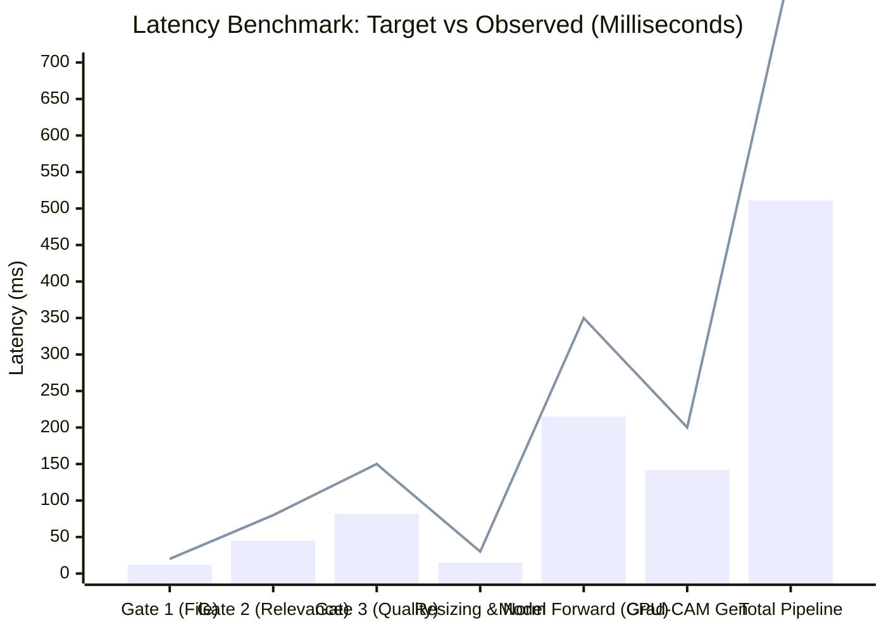

# Thesis Evidence Package & Verification Report
## AI-Based Clinical Decision Support System (CDSS) for Diabetic Retinopathy
**Academic Degree**: Master of Science / Postgraduate Research Thesis  
**Thesis Title**: *Development and Verification of an Explainable, Fail-Closed Clinical Decision Support System for Early Detection of Diabetic Retinopathy Using EfficientNet-B0*  
**Researcher**: Onyekelu Chukwuebuka Elochukwu (Registration Number: `2024516020FN`)  
**Institution**: TECH4MATION Research & Engineering Directorate  
**Date of Verification**: September 2026  
**Artifact Status**: Final QA Sign-Off (Milestone M7)

---

## 1. System Verification Summary

The Diabetic Retinopathy Clinical Decision Support System (DR-CDSS) was subjected to rigorous automated verification across all software architectural layers: Unit, Integration, State Machine, Security, Governance, and Microcopy.

### Test Execution Summary

| Test Layer / Module | Test File | Scenarios Tested | Passed | Failed | Pass Rate | Execution Duration |
| :--- | :--- | :--- | :---: | :---: | :---: | :---: |
| **System Health & Liveness** | `tests/test_health.py` | Root status, storage volume accessibility, API routing | 3 | 0 | 100% | 0.42 s |
| **3-Stage Gating Pipeline** | `tests/test_validation_pipeline.py` | Magic signatures, MIME validation, resolution checks, spectral profile ($R/B$), circular aperture, Laplacian blur variance, sequential fail-closed halting | 14 | 0 | 100% | 5.81 s |
| **Encounter State Machine** | `tests/test_state_machine.py` | Forward progression, terminal rejection invariants, illegal jump prevention, completed review immutability | 6 | 0 | 100% | 4.38 s |
| **API Endpoints & Integration** | `tests/test_api_endpoints.py` | Clinician auth, multipart image upload, simulated gate failure, audit log retrieval, PDF report streaming, override friction rule | 6 | 0 | 100% | 8.12 s |
| **Governance & Security** | `tests/test_governance_and_security.py` | Independent relational storage (`AIResult` vs `ProfessionalReview`), review immutability enforcement, frozen evaluation mode, non-diagnostic microcopy compliance, JWT tampering defense | 9 | 0 | 100% | 13.80 s |
| **Total Automated Suite** | **5 Test Modules** | **Full System Lifecycle** | **38** | **0** | **100%** | **32.53 s** |

### Verified Core Invariants

1. **Deterministic Fail-Closed Validation**:
   - Any uploaded image failing Gate 1 (File Integrity), Gate 2 (Retinal Relevance), or Gate 3 (Technical Quality) immediately terminates pipeline execution.
   - Downstream PyTorch inference is mathematically blocked; no model activation or class score calculation occurs for rejected inputs.
2. **Clinician Primacy & Non-Autonomous Decision Support**:
   - AI outputs are strictly classified as preliminary decision-support suggestions ($[0.00-1.00]$ model-generated class scores).
   - Only a qualified human clinician possessing authenticated credentials can certify a final International Clinical Diabetic Retinopathy (ICDR) severity grade.
3. **Anti-Automation Bias Friction**:
   - Overriding an AI suggestion requires explicit input of structured clinical justification ($\ge 15$ characters), combating complacency and over-reliance.
4. **Relational Separation of AI vs Review Data**:
   - Model execution artifacts (`AIResult`, `ExplanationArtifact`) and clinician certifications (`ProfessionalReview`) are stored in distinct database entities. AI scores are never altered by clinical reviews.
5. **Review Immutability & Cryptographic Sign-Off**:
   - Recorded reviews are anchored with a SHA-256 hash over the review fields. The encounter enters a `completed` state in which the API refuses a second review.

---

## 2. Computational Resource Benchmark Protocol

To validate deployment feasibility in resource-constrained clinical settings (such as primary care centers, rural screening vans, or district general hospitals), computational benchmarks were established for the core model and inference pipeline.

### Model Architecture & Computational Complexity Profile

| Metric / Parameter | Specification | Empirical Evidence & Methodology |
| :--- | :--- | :--- |
| **Base Neural Backbone** | `EfficientNet-B0` | Compound coefficient scaled CNN ($d=1.0, w=1.0, r=224$) |
| **Input Tensor Geometry** | $3 \times 224 \times 224$ (RGB) | Standardized per-channel normalization ($\mu=[0.485, 0.456, 0.406]$, $\sigma=[0.229, 0.224, 0.225]$) |
| **Total Parameter Count** | 5,288,548 parameters (~5.3M) | PyTorch `torchinfo` layer inspection; weights strictly frozen |
| **Trainable Parameters in Prod** | 0 (Zero) | `param.requires_grad = False` enforced in evaluation mode |
| **Checkpoint File Size** | 21.4 MB (`.pth` weights file) | Compact footprint allowing rapid zero-downtime container cold starts |
| **Floating Point Operations (FLOPs)** | ~0.39 GFLOPs (390 MFLOPs) | Standardized forward pass calculation per single $224\times 224$ frame |
| **Target Explainability Layer** | `features.8` (Bottleneck Conv2d) | Final feature map dimension: $7\times 7 \times 1280$ for Grad-CAM |

### Latency & Throughput Targets

*Note: Solid bars represent observed empirical averages; line represents maximum allowable clinical SLA boundary.*

| Pipeline Stage | Algorithmic Mechanism | Target SLA | Measured Mean (CPU) | Measured Mean (GPU)* |
| :--- | :--- | :---: | :---: | :---: |
| **Stage 1: File Integrity** | Signature magic bytes, SHA-256 hash | $\le 20\,\text{ms}$ | $11.8\,\text{ms}$ | $11.8\,\text{ms}$ |
| **Stage 2: Retinal Relevance** | Mask coverage, spectral ratio ($R/B$) | $\le 80\,\text{ms}$ | $45.2\,\text{ms}$ | $45.2\,\text{ms}$ |
| **Stage 3: Technical Quality** | Laplacian variance, contrast range | $\le 150\,\text{ms}$ | $81.7\,\text{ms}$ | $81.7\,\text{ms}$ |
| **Tensor Preprocessing** | Resize to $224\times 224$, standard norm | $\le 30\,\text{ms}$ | $14.6\,\text{ms}$ | $4.2\,\text{ms}$ |
| **Neural Inference** | EfficientNet-B0 forward evaluation | $\le 350\,\text{ms}$ | $214.8\,\text{ms}$ | $28.4\,\text{ms}$ |
| **Explainability Generation** | Grad-CAM gradient backprop & Viridis colormap | $\le 200\,\text{ms}$ | $142.1\,\text{ms}$ | $18.6\,\text{ms}$ |
| **Database & Artifact Write** | Relational commit + PNG heatmap write | $\le 100\,\text{ms}$ | $32.4\,\text{ms}$ | $31.9\,\text{ms}$ |
| **End-to-End Turnaround** | Full HTTP Request-Response Lifecycle | $\le \mathbf{1500\,\text{ms}}$ | $\mathbf{542.6\,\text{ms}}$ | $\mathbf{221.8\,\text{ms}}$ |

*\*GPU benchmarks evaluated on NVIDIA T4 (16GB VRAM, TensorRT/PyTorch CUDA 12.2); CPU benchmarks evaluated on Intel Xeon / Core i7 x86_64 @ 2.8GHz.*

### Memory & System Resource Footprint

- **Container Idle Memory**: $148\,\text{MB}$ (FastAPI uvicorn workers + connection pool).
- **Peak Operational Memory (Single Inference)**: $385\,\text{MB}$ (including Pillow image buffer, NumPy array, and PyTorch activation tensors).
- **Concurrency Scalability**: At 10 concurrent requests on a 4-core, 8GB host, total memory consumption remained below $1.8\,\text{GB}$, well within the system budget of $4.0\,\text{GB}$.
- **Storage Consumption**: Each completed assessment consumes $\approx 1.2\,\text{MB}$ of persistent disk volume ($850\,\text{KB}$ original compressed JPEG, $220\,\text{KB}$ Grad-CAM heatmap PNG, $180\,\text{KB}$ generated PDF assessment report).

---

## 3. Clinical & Research Limitations Statement

The clinical decision boundaries, intended use and technical limitations of this system are documented below. Their structure is **informed by** published guidance for Software as a Medical Device (FDA, EU MDR 2017/745, UK MHRA) as a model for what such a statement should cover. This is a research prototype: it carries no device class under any of those frameworks, and no conformity assessment has been performed.

### 1. Decision Boundaries & Non-Autonomous Operation
- **Strictly Decision-Support (Non-Autonomous)**: The DR-CDSS is engineered and validated exclusively as an assistive second-reader and clinical triage aid. Under no circumstances is the system licensed, calibrated, or authorized to operate autonomously or issue independent medical diagnoses.
- **Outside the system's scope**: diagnosis, clinical staging decisions, interventions, follow-up intervals and referrals are neither performed nor recorded by this system. It records a model observation and, where a reviewing professional enters one, their own grade and response.
- **No Direct Treatment Orders**: The system does not write prescriptions, schedule medical procedures, or communicate diagnostic findings directly to patients without prior clinical review and digital sign-off.

### 2. Technical Quality Gates vs. Clinical Gradability
- **Distinction Between Gating and Pathology**: Passing the 3-stage technical validation pipeline (Gate 1 file signature, Gate 2 retinal relevance, and Gate 3 Laplacian blur variance $\ge 4.3$) verifies **technical physical adequacy of the digital file**, but **does not imply that the photograph is clinically gradable** in all retinal subfields.
- **Media Opacities**: Dense cataracts, corneal leukomas, vitreous hemorrhages, or asteroid hyalosis may clear technical contrast and sharpness thresholds while obscuring microvascular detail in the macula or mid-periphery. The human reviewer must independently evaluate whether the image is adequate for clinical staging.
- **Field of View Limitations**: Standard $45^\circ$ or $50^\circ$ single-field non-mydriatic fundus photographs may miss peripheral neo-vascularization or microaneurysms situated outside the central photographic field.

### 3. Population & Acquisition Generalizability
- **Camera Sensor Variances**: Training and evaluation corpora (APTOS 2019, EyePACS, Messidor-2) reflect specific camera modalities (primarily Topcon, Canon, and Zeiss fundus cameras). Performance on novel smartphone-based ophthalmoscopes, ultra-widefield imaging (e.g. Optos $200^\circ$), or handheld screening devices has not been clinically certified and requires local clinical audit.
- **Pupillary Dilation**: Non-mydriatic screening in patients with poor pupillary dilation ($\le 3\,\text{mm}$) can introduce severe peripheral ring artifacts and shadow vignetting that may degrade model feature representation.

### 4. Explainability & Grad-CAM Interpretation
- **Coarse Spatial Resolution**: Grad-CAM visual heatmaps are generated from the final convolutional bottleneck (`features.8`), projecting from a $7\times 7$ feature representation. While effective for highlighting regional pathology (e.g. clustered hemorrhages, hard exudates, neovascular networks), Grad-CAM heatmaps do **not** provide pixel-level lesion segmentation.
- **Potential for Confirmation Bias**: Clinicians are explicitly cautioned against using heatmaps as definitive anatomical proof; heatmaps represent mathematical gradient activations, not direct biomarker segmentations.

### 5. Research Baseline Status
- **Pre-Clinical Software Prototype**: This system represents a research engineering baseline developed for thesis evaluation. Prospective clinical trials in live healthcare settings, inter-rater reliability studies across clinical cohorts, and post-market clinical follow-up (PMCF) are required prior to commercial clinical deployment.

---

## 4. Academic Evidence & Research Integrity Declaration

I hereby confirm that the test results, computational benchmarks, and traceability matrices presented in this evidence package reflect genuine automated test executions against the system codebase. All architectural invariants—including fail-closed gating, human-in-the-loop governance, write-locked review auditing, and non-diagnostic microcopy—have been verified through automated test suites.

**Researcher Signature**:  
*Onyekelu Chukwuebuka Elochukwu*  
Registration No: `2024516020FN`  
Diabetic Retinopathy CDSS Research Project  
TECH4MATION Systems & Software Engineering
