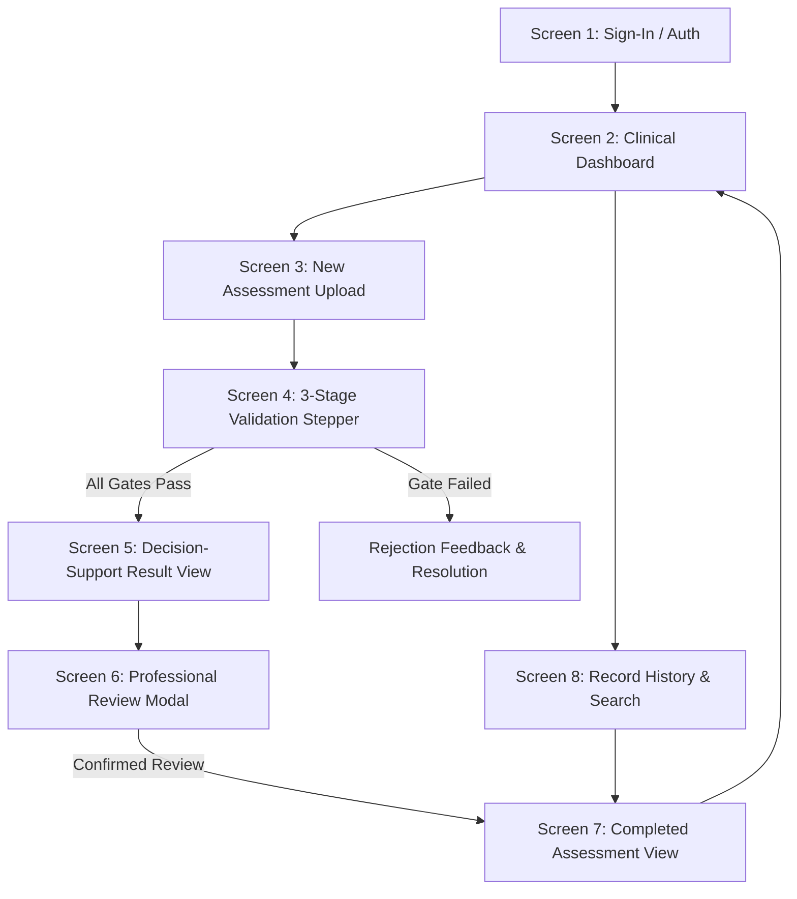
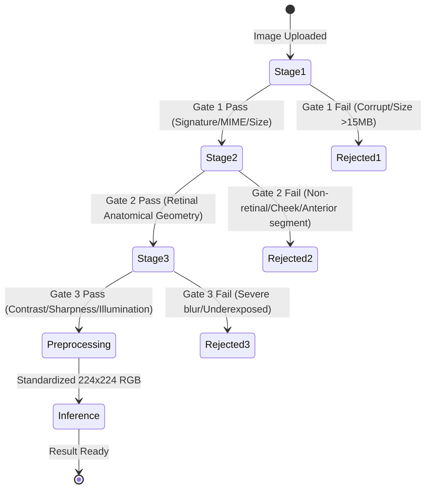
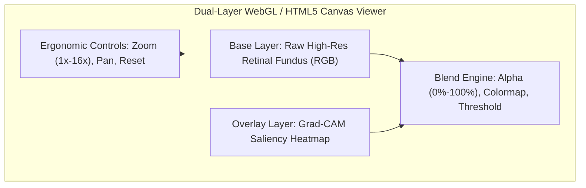
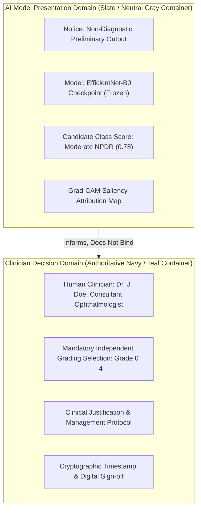

# Clinical UX & Human-AI Interaction Specifications
## AI-Based Clinical Decision Support System (CDSS) for Diabetic Retinopathy
**Document Version**: 1.0  
**Project**: Clinical Decision Support System for Early Detection of Diabetic Retinopathy (EfficientNet-B0)  
**Lead Researcher**: Onyekelu Chukwuebuka Elochukwu (2024516020FN)  
**Target Standard**: Prototype Tool (Software as a Medical Device) Clinical Guidance, NHS England Digital Health Technology Standards (DTAC / NICE ESF), WCAG 2.1 AA Compliance  

---

## Executive Summary & Clinical Governance Rationale

This document establishes the user experience (UX), human-computer interaction (HCI), ergonomics, accessibility, and clinical safety specifications for the Diabetic Retinopathy Clinical Decision Support System (DR-CDSS). 

The primary purpose of this CDSS is to assist qualified healthcare professionals (ophthalmologists, optometrists, general practitioners, and retinal screening technicians) in the early identification and severity classification of Diabetic Retinopathy (DR) from digital retinal fundus photography.

### Fundamental Clinical Principles
1. **Clinician Authority (Human-in-the-Loop)**: The system is explicitly designed as a *Class II Software as a Medical Device (SaMD)* decision-support aid, **not** an autonomous diagnostic engine. The clinician retains ultimate diagnostic, clinical staging, and treatment authority.
2. **Fail-Closed Validation**: Model inference is mathematically forbidden unless an uploaded image successfully clears a 3-stage validation pipeline (File Integrity, Retinal Relevance, and Technical Quality).
3. **Strict Bounded Terminology**: The UI strictly forbids misleading pseudo-certainty terms such as "confidence", "certainty", or "diagnostic accuracy". Scores are explicitly presented as "model-generated class scores" $[0.00 - 1.00]$ alongside contextualized class distribution bars.
4. **Cognitive Bias Mitigation**: The interface actively combats automation bias (over-reliance) and alert fatigue (under-reliance) through intentional visual demarcation, friction-engineered review confirmations, and synchronized explainability overlays (Grad-CAM).

---

## 1. Clinical User Journey Through the 8 Core Screens

The clinical workflow is structured into 8 distinct screens, matching real-world clinical screening, grading clinics, and audit operations.



### Screen 1: Sign-In & Authenticated Clinical Session
* **Clinical Purpose**: Authenticate credentialed clinicians, enforce session security, and tie every subsequent assessment to an identifiable reviewer for medical-legal traceability.
* **Key Components**:
  * Clean, distraction-free authentication card with institutional branding.
  * Form fields: Staff ID / Email, Password, Clinical Facility / Ward selector.
  * Security indicator: TLS 1.3 encryption status badge, Session timeout notification (automatic logout after 15 minutes of inactivity per clinical workstation policies).
  * Prominent medical regulatory disclaimer banner: *"For clinical decision support only. Requires authorized clinical credentials."*
* **Error Handling**: Rate limiting (5 failed attempts locks out for 15 minutes), clear non-technical guidance for password recovery.

### Screen 2: Clinical Dashboard & Triage Worklist
* **Clinical Purpose**: High-level overview of ongoing screening sessions, patient queue, and triage priorities.
* **Key Components**:
  * **Top Metrics Ribbon**: Total Assessments Today, Pending Clinician Review, Technical Rejections, High-Priority Flagged Cases.
  * **Quick-Action Bar**: "New Assessment Upload" (primary visual prominence), "Search Records", "Export Daily Audit Log".
  * **Interactive Worklist Table**:
    * Columns: Patient / Study ID, Acquisition Date/Time, Laterality (OD / OS), Technical Quality Status, Preliminary Model Class Score (categorized with neutral indicator tags), Review Status (`Pending Review`, `Under Review`, `Completed`, `Rejected`), Action Button.
  * **Status Pills**:
    * `Validating`: Blue pulsating badge.
    * `Needs Review`: Amber pill with high-contrast icon.
    * `Completed`: Muted teal pill with checkmark.
    * `Rejected`: Slate-grey pill with cancellation diagonal.
* **Ergonomics**: Quick keyboard shortcuts (`Alt+N` for new assessment, `/` to focus search table).

### Screen 3: New Assessment Upload & Patient Context
* **Clinical Purpose**: Secure ingestion of retinal fundus photographs with minimal clinical cognitive load, capturing essential clinical laterality and de-identified study parameters.
* **Key Components**:
  * **Patient Context Form**:
    * Study / Patient Identifier (sanitized, alphanumeric, HIPAA/GDPR compliant de-identification field).
    * Eye Laterality Toggle: `OD` (Right Eye) vs. `OS` (Left Eye) with visual anatomical eye glyphs.
    * Optional clinical notes: Mydriatic vs. Non-mydriatic camera, camera model.
  * **Drag-and-Drop Ingestion Zone**:
    * High-visibility drop target with dashed boundary and cloud-upload iconography.
    * Client-side pre-flight checks: Enforces MIME types (JPEG, PNG only) and size constraints ($\le 15\,\text{MB}$).
    * Immediate thumbnail generation with file metadata display (filename, size, native dimensions).
* **Failsafes**: Clear error messaging if non-image or unsupported formats (DICOM uncompressed without converter, TIFF, BMP) are dropped, detailing exact resolution steps.

### Screen 4: Real-Time 3-Stage Validation Stepper
* **Clinical Purpose**: Visualizes the system's "Fail-Closed" input validation pipeline. Prevents "garbage-in, garbage-out" ML failure modes and builds clinician trust by exposing technical gating.
* **State Machine & Stepper Progression**:



* **Visual Stepper Elements**:
  * **Gate 1: File Integrity & Security**: Checks magic numbers (`\xFF\xD8\xFF` for JPEG, `\x89PNG` for PNG), virus scan, dimension sanity ($\ge 512\times 512\,\text{px}$).
  * **Gate 2: Retinal Anatomical Relevance**: Verifies circular fundus mask, red/orange spectral balance, optic disc/macula structural presence via OpenCV.
  * **Gate 3: Technical Image Quality**: Laplacian blur variance metric, histogram illumination homogeneity, contrast dynamic range.
* **Gate Failure Display**:
  * Replaces generic "Error" with structured clinical guidance:
    * *Reason*: e.g., "Image rejected by Technical Quality Gate: Laplacian variance below acceptable threshold (motion blur detected)."
    * *Actionable Next Step*: "Please recapture fundus photograph ensuring patient fixation is steady and lens is clean."
  * **Regulatory Notice**: *"Image does not meet quality requirements. To prevent erroneous analysis, automated model evaluation has been aborted."*

### Screen 5: Decision-Support Result View (Core Interactive Workspace)
* **Clinical Purpose**: The primary diagnostic workstation where the clinician analyzes the original fundus photograph, evaluates Grad-CAM visual heatmaps, examines the 5-class score distribution, and prepares their clinical decision.
* **Layout Structure**:
  * **Top Safety Banner (Persistent)**:
    > **NOTICE: CLINICAL DECISION SUPPORT ONLY — NOT FOR INDEPENDENT DIAGNOSIS**  
    > Model-generated scores represent preliminary mathematical associations. Diagnostic judgment, clinical staging, and management plans remain exclusively the responsibility of the reviewing clinician.
  * **Left Pane (65% width)**: Dual-Layer Fundus & Grad-CAM Interactive Viewer (detailed in Section 2).
  * **Right Pane (35% width)**:
    * **Assessment Summary Card**: Patient ID, Laterality (`OD`/`OS`), Capture Date, Image Quality Scores (Laplacian metric, Illumination index).
    * **Model-Generated Class Scores Card**:
      * Primary Candidate Class: e.g., `Moderate NPDR (Stage 2)` with associated model score (e.g., `0.78`).
      * 5-Class Probability Distribution (horizontal stacked bar charts normalized to $1.00$):
        1. Class 0: No DR ($0.04$)
        2. Class 1: Mild NPDR ($0.12$)
        3. Class 2: Moderate NPDR ($0.78$)
        4. Class 3: Severe NPDR ($0.05$)
        5. Class 4: Proliferative DR ($0.01$)
    * **Explainability Insights**: Grad-CAM target layer notification (`features.8` of EfficientNet-B0), top anatomical activation region (e.g., *Inferotemporal quadrant microaneurysms / retinal hemorrhage zone*).
    * **Action Bar**: "Initiate Clinician Review" (Primary button, calls Screen 6), "Download Preliminary Technical Sheet" (Secondary).

### Screen 6: Professional Review Modal / Drawer
* **Clinical Purpose**: Formal clinical governance checkpoint where the human clinician reviews the AI's preliminary observation, selects their independent clinical assessment, and signs off.
* **Key Components**:
  * **Clinical Agreement Tri-State Selector** (Mutually exclusive high-contrast radio cards):
    * `Agree with AI Observation`: Concurs that patient exhibits findings matching model's top class.
    * `Disagree with AI Observation`: Clinician identifies a different stage.
    * `Unable to Determine / Inconclusive`: Image exhibits clinical artifacts, non-DR pathology, or ambiguity.
  * **Clinician Certified Classification (ICDR 5-Grade)**:
    * Grade 0: No Apparent Retinopathy
    * Grade 1: Mild Non-Proliferative DR (Microaneurysms only)
    * Grade 2: Moderate Non-Proliferative DR (More than microaneurysms, less than severe)
    * Grade 3: Severe Non-Proliferative DR (4-2-1 rule: 20+ intraretinal hemorrhages in 4 quadrants, venous beading in 2+ quadrants, or IRMA in 1+ quadrant)
    * Grade 4: Proliferative Diabetic Retinopathy (Neovascularization, vitreous/preretinal hemorrhage)
  * **Mandatory Disagreement Justification**: Conditional multi-line text area activated when `Disagree` or `Unable to Determine` is chosen (minimum 15 characters required before submission is enabled).
  * **Management & Referral Plan**:
    * Routine 12-month recall
    * Repeat photograph in 3–6 months
    * Referral to secondary care / medical retina clinic
    * Urgent referral (vitrectomy / anti-VEGF clinic)
  * **Clinician Digital Signature**: Reviewer Name, Professional License / GMC / Registration Number, Timestamp.

### Screen 7: Completed Assessment & Audit View
* **Clinical Purpose**: Immutable record of the completed screening encounter, presenting the clinical review and the preliminary AI output as distinct, linked records.
* **Key Components**:
  * **Lock Status Indicator**: Shield icon with "Assessment Finalized & Signed — Record Immutable".
  * **Side-by-Side Verification Summary**:
    * Box A (AI Preliminary Output): Generated timestamp, model version (`EfficientNet-B0-DR-v1`), candidate class score.
    * Box B (Certified Clinical Diagnosis): Reviewing Clinician Name, Confirmed ICDR Stage, Justification Notes, Referral Recommendation, Signature Timestamp.
  * **Export Actions**:
    * "Download Tamper-Evident Clinical Report (PDF)" (Includes cryptographic SHA-256 hash of original image and assessment).
    * "Print Record".

### Screen 8: Record History, Search & Longitudinal Audit
* **Clinical Purpose**: Longitudinal record review, cohort management, compliance auditing, and research evaluation.
* **Key Components**:
  * **Faceted Search Filters**: Date range picker, ICDR severity filter, Agreement filter (`Clinician Agreed`, `Clinician Overrode`, `Inconclusive`), Reviewer filter.
  * **Tabular Historical View**: Pagination, sortable headers, exportable to CSV/JSON for clinical audit committees.
  * **Audit Event Drawer**: Slide-over panel detailing full immutable audit ledger for any selected record (Logins, Uploads, Gate evaluations, Review submissions, PDF downloads).

---

## 2. Ophthalmic Fundus & Grad-CAM Viewer Interaction Ergonomics

Retinal fundus image analysis demands high visual fidelity, sub-pixel rendering, and flexible visual overlay controls to inspect delicate lesions (microaneurysms, dot-and-blot hemorrhages, hard exudates, and subtle cotton-wool spots).



### 2.1 Dual-Layer Canvas/WebGL Architecture
* **Canvas Stacking**: Two synchronized rendering buffers:
  1. `Base Canvas` ($Z=1$): Original photographic fundus RGB data at full native resolution (typically $2000\times 2000$ or $3000\times 3000$ downsampled smoothly using Lanczos or bicubic filtering).
  2. `Attribution Canvas` ($Z=2$): Upscaled Grad-CAM activation matrix rendered with WebGL fragment shaders for real-time interpolation.
* **Synchronous Spatial Transformation**:
  * Both canvases are bound to a unified 2D affine transformation matrix:
    $$\begin{bmatrix} x' \\ y' \\ 1 \end{bmatrix} = \begin{bmatrix} s & 0 & t_x \\ 0 & s & t_y \\ 0 & 0 & 1 \end{bmatrix} \begin{bmatrix} x \\ y \\ 1 \end{bmatrix}$$
    where $s$ is the uniform zoom factor ($1.0 \le s \le 16.0$) and $(t_x, t_y)$ are the translational pan coordinates.
* **Pan & Zoom Ergonomics**:
  * **Zoom**: Mouse wheel or two-finger trackpad pinch, centered directly at current cursor coordinates $(x_{cursor}, y_{cursor})$, preventing disorienting focal jumps.
  * **Pan**: Left-click drag (or `Spacebar + Left Drag`), with natural inertia and bounded edges preventing the fundus disc from disappearing off-screen.
  * **Preset Quick Controls**:
    * `Fit to Window` (`Ctrl+0` / `Cmd+0`): Resets scale such that circular fundus diameter fills 95% of viewport.
    * `1:1 Native Resolution` (`Ctrl+1`): Displays one camera pixel per display pixel for granular lesion inspection.
    * `2x Zoom` / `4x Zoom` quick-jump chips.
    * `Center & Reset` (`R` key).

### 2.2 Grad-CAM Heatmap Blending Controls
The viewer provides three complementary interaction modes:

1. **Continuous Alpha-Blending Slider**:
   * Range: $0\%$ (Raw fundus only) to $100\%$ (Full saliency heatmap only).
   * Default on load: $45\%$ opacity (permits simultaneous visualization of underlying vascular tree and high-activation zones).
   * Step: $1\%$ smooth CSS/WebGL variable binding.
   * High-contrast digital readout beside slider (`45%`).
2. **Side-by-Side Synchronized Comparison Mode**:
   * Viewport splits into dual synchronized panes (Left: Raw Fundus; Right: Raw Fundus + 50% Grad-CAM).
   * Pan and zoom events in either pane instantly update the adjacent pane with zero latency.
   * Allows simultaneous anatomical verification and algorithmic explanation without toggling.
3. **Instant A/B Quick-Toggle (Blink Inspection)**:
   * Holding down `Spacebar` or pressing `Tab` flips the overlay opacity from the current slider setting to $0\%$ instantly; releasing returns to previous opacity.
   * Leverages human visual flicker-detection physiology to distinguish subtle microaneurysms beneath heatmap peaks.
4. **Activation Threshold Filter (Contour Isolation)**:
   * Secondary slider (Range: $0.00$ to $0.90$, default $0.30$): Truncates low-level background gradients below threshold to render them completely transparent, focusing exclusively on salient focal lesions.

### 2.3 Perceptually Uniform & Accessible Colormaps

#### Scientific Critique of Jet / Turbo in Medical SaMD
* **The "Rainbow Fallacy"**: Colormaps like `Jet` and `Rainbow` have been extensively discouraged in clinical radiology and ophthalmology literature (e.g., Crameri et al., *Nature Communications*, 2020; Borkin et al., *IEEE TVCG*).
* **Deficiencies of Jet/Turbo**:
  1. **Non-Perceptual Uniformity**: Sharp perceptual color transitions occur at yellow and cyan even when data values change linearly, generating artificial visual boundaries ("Mach bands") that clinicians interpret as distinct lesion borders.
  2. **Severe Inaccessibility**: Completely illegible for individuals with red-green color vision deficiencies (protanopia/deuteranopia, affecting ~8% of males and ~0.5% of females). Red and green appear as indistinguishable muddy olive tones.
  3. **Luminance Inversion**: In Jet, yellow has higher perceived luminance than red, confusing the intuitive hierarchy of "hot spots".

#### Recommended Medical Colormap Suite

| Colormap | Luminance Curve | Colorblind Safety | Clinical Application & Rationale |
| :--- | :--- | :--- | :--- |
| **Viridis** *(Default)* | Monotonically increasing (Dark Purple $\rightarrow$ Teal $\rightarrow$ Bright Yellow) | **100% Safe** (Deuteranopia, Protanopia, Tritanopia) | **Primary Standard**: Optimal contrast against deep red/orange retinal fundus backgrounds. Perceptually uniform across entire dynamic range. |
| **Inferno** | Monotonically increasing (Deep Black $\rightarrow$ Violet $\rightarrow$ Vivid Red $\rightarrow$ Warm Yellow) | **Safe** | **Lesion Focus**: Excellent high dynamic range. Highlights high-activation micro-lesions in brilliant yellow while keeping low activations dark and unobtrusive. |
| **Magma** | Monotonically increasing (Black $\rightarrow$ Purple $\rightarrow$ Peach $\rightarrow$ White) | **Safe** | **Alternative High-Contrast**: Delivers sharp demarcation for subtle vascular and macular exudate attributions. |
| **Cividis** | Monotonically increasing (Dark Blue $\rightarrow$ Grey $\rightarrow$ Yellow) | **Formally mathematically optimized for CVD** | **Accessibility Benchmark**: Specifically designed for maximum perceptual uniformity under severe color vision deficiencies. |

* **Colormap Switcher Component**:
  * Dropdown selector with live gradient preview swatches for each map.
  * Colormap legend bar placed below the canvas showing normalized attribution scale $[0.0, 1.0]$ with descriptive anchor labels: `Low Importance` $\rightarrow$ `Peak Attribution` (avoiding absolute probability terms).

---

## 3. Human-AI Interaction & Clinician-in-the-Loop Safeguards (Prototype Tool & NHS Guidelines)

In compliance with FDA Software as a Medical Device (SaMD) Guidance, NHS England Code of Conduct for AI in Healthcare, and NICE Evidence Standards Framework, the system enforces strict boundaries between automated computation and clinical evaluation.

### 3.1 Strict Non-Diagnostic Microcopy & Wording Invariants

The CDSS enforces standardized terminology at both UI and documentation levels to prevent over-reliance and misinterpretation:

```
+-----------------------------------+--------------------------------------------+
| FORBIDDEN TERMS                   | MANDATORY PRESCRIBED REPLACEMENTS          |
+-----------------------------------+--------------------------------------------+
| "AI Diagnosis"                    | "Preliminary Model-Generated Observation"  |
| "Confidence: 94%"                 | "Model-Generated Class Score: 0.94"        |
| "Certainty" / "Probability"       | "Class Relative Weight" / "Score"          |
| "AI verified this image"         | "Image passed technical validation checks" |
| "Good image quality"              | "Meets technical thresholds for inference" |
| "Normal Retina"                   | "No Apparent DR Detected by Model"         |
| "Definitive Stage"                | "Candidate Classification"                 |
+-----------------------------------+--------------------------------------------+
```

> **Mandatory UI Microcopy Banner (Screen 5 & Screen 7)**:  
> *"Passed technical validation confirms image sharpness, contrast, and retinal structure only; it does not constitute clinical gradability. The final diagnosis and grading decision are solely the responsibility of the reviewing medical professional."*

### 3.2 Visual Demarcation of System States

To prevent the clinician from perceiving AI suggestions as authoritative findings, the interface strictly separates AI output from the human review domain:



* **Visual Styling Separation**:
  * **AI Output Box**: Border: `border-slate-200` (`border-slate-700` in dark mode); Background: `bg-slate-50` (`bg-slate-900/50`); Header tag: `[AI Assistive Engine]`.
  * **Clinician Review Box**: Border: `border-teal-500`; Background: `bg-teal-50/30` (`bg-teal-950/20`); Header tag: `[Official Clinical Evaluation]`.

### 3.3 Friction Engineering & Anti-Automation Bias Controls

Automation bias occurs when clinicians passively accept AI recommendations without critical scrutiny. The CDSS introduces intentional interaction friction:

1. **No Pre-Selected Default Radio**:
   * In Screen 6 (Review Modal), neither "Agree", "Disagree", nor any ICDR grade is pre-selected. The clinician must make an active, deliberate physical click/keystroke.
2. **Mandatory Justification for Overrides and Indeterminate Cases**:
   * If `Disagree with AI Observation` is selected, the "Confirm Review" button remains disabled until the clinician enters a clinically valid rationale ($\ge 15$ characters) in the justification field.
   * If `Unable to Determine` is selected, the system requires selection of an inconclusive reason (e.g., *Cataract / Media Opacity*, *Uncertain Peripheral Lesion*, *Artifactual Reflection*).
3. **Mandatory Explicit Verification Step**:
   * Prior to final record committing, a verification modal displays a side-by-side confirmation:
     * *"You are submitting a final clinical classification of **Severe NPDR** (AI model score was **Moderate NPDR**). Once signed, this record cannot be modified."*
     * Requires clicking **"Confirm and Sign Record"**.

---

## 4. WCAG 2.1 AA Accessibility & Frontend Design System Tokens

The application must meet or exceed WCAG 2.1 Level AA accessibility standards, ensuring usability in diverse clinical environments (dimmed ophthalmic screening rooms, bright outpatient clinics) and accommodating clinicians with motor, visual, or cognitive needs.

### 4.1 Accessibility Standards Matrix

| Guideline | Requirement | Technical Implementation in CDSS |
| :--- | :--- | :--- |
| **1.4.3 Contrast (Minimum)** | Contrast ratio $\ge 4.5:1$ for normal text, $\ge 3:1$ for large text/icons. | High-contrast text tokens (`text-slate-900` on `bg-white`, `text-slate-100` on `bg-slate-900`). Color-coded tags use high-contrast foreground/background pairs. |
| **1.4.1 Use of Color** | Color is never used as the sole method of conveying information. | Every status badge pairs color with an explicit semantic icon and text label (e.g., Checkmark icon + "Pass", Cross icon + "Fail"). |
| **2.1.1 Keyboard Navigation** | All interactive components accessible via keyboard. | Logical `tabindex` ordering; full spatial keyboard navigation in image viewer (`Arrows` to pan, `+`/`-` to zoom, `Space` to blink, `Esc` to close modals). |
| **2.4.7 Focus Visible** | Highly visible focus rings on all active elements. | Tailwind `focus-visible:ring-2 focus-visible:ring-teal-500 focus-visible:ring-offset-2`. Focus outline is never suppressed (`outline-none` alone is prohibited). |
| **4.1.2 Name, Role, Value** | Proper ARIA roles, states, and properties. | Full ARIA landmark semantics (`role="region"`, `role="status"`, `aria-live="polite"` on validation stepper, `aria-valuenow` on sliders). |

### 4.2 Keyboard Navigation Contract

```
+-------------------+------------------------------------+-------------------------------------------+
| KEY COMBINATION   | CONTEXT                            | ACTION                                    |
+-------------------+------------------------------------+-------------------------------------------+
| Tab / Shift+Tab   | Global                             | Moves focus sequentially through controls |
| Enter / Space     | Buttons, Radio Cards               | Activates or selects focused control      |
| Escape            | Modals, Drawers, Lightbox          | Dismisses active overlay                  |
| + / =             | Retinal Viewer                     | Zooms in by +25%                          |
| - / _             | Retinal Viewer                     | Zooms out by -25%                         |
| Arrow Keys        | Retinal Viewer                     | Pans view in directional steps            |
| Spacebar (Hold)   | Retinal Viewer                     | Blinks Grad-CAM overlay to 0% opacity    |
| R                 | Retinal Viewer                     | Resets zoom and pan to default fit        |
| Alt + N           | Dashboard                          | Jumps to "New Assessment Upload"          |
| /                 | Dashboard / History                | Focuses Search input field                |
+-------------------+------------------------------------+-------------------------------------------+
```

### 4.3 Semantic Design Tokens (Tailwind CSS Contract)

These design tokens provide the direct styling contract for `ui_frontend_agent`:

```json
{
  "theme": {
    "extend": {
      "colors": {
        "clinical": {
          "primary": "#0F766E",       // Deep clinical teal (NICE/NHS style)
          "primary-hover": "#115E59",
          "primary-light": "#CCFBF1",
          "secondary": "#1E293B",     // Navy slate
          "surface": "#F8FAFC",       // Clean light background
          "surface-card": "#FFFFFF",
          "surface-dark": "#0B0F17",  // High-contrast viewer canvas background
          "border": "#E2E8F0",
          "border-dark": "#1E293B"
        },
        "status": {
          "pass": "#059669",          // Accessible Green (contrast > 4.5:1)
          "pass-bg": "#ECFDF5",
          "fail": "#DC2626",          // Accessible Red
          "fail-bg": "#FEF2F2",
          "warning": "#D97706",       // Accessible Amber
          "warning-bg": "#FFFBEB",
          "info": "#2563EB",          // High-visibility Blue
          "info-bg": "#EFF6FF"
        },
        "dr-severity": {
          "grade0": "#10B981",        // No DR (Muted Green)
          "grade1": "#06B6D4",        // Mild NPDR (Cyan)
          "grade2": "#F59E0B",        // Moderate NPDR (Amber)
          "grade3": "#F97316",        // Severe NPDR (Orange)
          "grade4": "#EF4444"         // Proliferative DR (Crimson)
        }
      },
      "fontFamily": {
        "sans": ["Inter", "system-ui", "sans-serif"],
        "mono": ["JetBrains Mono", "monospace"]
      }
    }
  }
}
```

### 4.4 Semantic DOM Component Wireframe Contracts

#### 1. Real-Time Validation Stepper Component (`ValidationStepper.tsx`)
```html
<nav aria-label="Image Validation Pipeline Progress" class="w-full py-4">
  <ol class="flex items-center justify-between w-full" role="list">
    <!-- Stage 1 -->
    <li class="flex items-center space-x-3" aria-current="false">
      <div class="flex items-center justify-center w-8 h-8 rounded-full bg-clinical-primary text-white" aria-hidden="true">
        <svg class="w-4 h-4 fill-current"><!-- Checkmark Icon --></svg>
      </div>
      <div>
        <p class="text-xs font-semibold text-slate-500 uppercase tracking-wider">Gate 1</p>
        <p class="text-sm font-medium text-slate-900">File Integrity</p>
        <span class="sr-only">Status: Passed</span>
      </div>
    </li>
    <!-- Divider -->
    <div class="flex-1 h-0.5 bg-slate-200 mx-4" aria-hidden="true"></div>
    <!-- Stage 2 -->
    <li class="flex items-center space-x-3" aria-current="step">
      <div class="flex items-center justify-center w-8 h-8 rounded-full border-2 border-clinical-primary text-clinical-primary" aria-hidden="true">
        <svg class="w-4 h-4 animate-spin"><!-- Spinner Icon --></svg>
      </div>
      <div>
        <p class="text-xs font-semibold text-clinical-primary uppercase tracking-wider">Gate 2</p>
        <p class="text-sm font-semibold text-slate-900">Retinal Relevance</p>
        <span class="sr-only">Status: In Progress</span>
      </div>
    </li>
    <!-- Divider -->
    <div class="flex-1 h-0.5 bg-slate-200 mx-4" aria-hidden="true"></div>
    <!-- Stage 3 -->
    <li class="flex items-center space-x-3 text-slate-400" aria-current="false">
      <div class="flex items-center justify-center w-8 h-8 rounded-full border-2 border-slate-300" aria-hidden="true">
        <span>3</span>
      </div>
      <div>
        <p class="text-xs font-semibold uppercase tracking-wider">Gate 3</p>
        <p class="text-sm font-medium">Technical Quality</p>
        <span class="sr-only">Status: Pending</span>
      </div>
    </li>
  </ol>
</nav>
```

#### 2. Dual-Layer Fundus & Grad-CAM Canvas Viewer (`FundusViewer.tsx`)
```html
<section 
  aria-label="Retinal Fundus and Grad-CAM Attribution Viewer"
  class="relative flex flex-col w-full h-[650px] bg-clinical-surface-dark rounded-xl overflow-hidden border border-slate-800 shadow-xl"
  role="region"
>
  <!-- Viewer Control Toolbar -->
  <header class="flex items-center justify-between px-4 py-2 bg-slate-900/90 backdrop-blur border-b border-slate-800 text-slate-200 z-20">
    <div class="flex items-center space-x-2">
      <span class="text-xs font-mono uppercase bg-slate-800 px-2 py-1 rounded text-teal-400 font-semibold">OD (Right Eye)</span>
      <span class="text-xs text-slate-400">Native: 2240x1488 px</span>
    </div>

    <!-- Zoom & Ergonomic Actions -->
    <div class="flex items-center space-x-1" role="toolbar" aria-label="Viewer zoom and display controls">
      <button 
        type="button" 
        class="p-1.5 rounded hover:bg-slate-800 focus-visible:ring-2 focus-visible:ring-teal-400" 
        title="Zoom In (+)"
        aria-label="Zoom in"
      >
        <svg class="w-4 h-4"><!-- Zoom In Icon --></svg>
      </button>
      <button 
        type="button" 
        class="p-1.5 rounded hover:bg-slate-800 focus-visible:ring-2 focus-visible:ring-teal-400" 
        title="Zoom Out (-)"
        aria-label="Zoom out"
      >
        <svg class="w-4 h-4"><!-- Zoom Out Icon --></svg>
      </button>
      <button 
        type="button" 
        class="px-2 py-1 text-xs font-mono rounded hover:bg-slate-800 focus-visible:ring-2 focus-visible:ring-teal-400" 
        title="Reset Zoom (R)"
        aria-label="Reset zoom to fit"
      >
        Reset
      </button>
      <div class="h-4 w-px bg-slate-700 mx-1"></div>
      <button 
        type="button" 
        class="px-2 py-1 text-xs rounded hover:bg-slate-800 focus-visible:ring-2 focus-visible:ring-teal-400"
        aria-pressed="false"
      >
        Side-by-Side
      </button>
    </div>

    <!-- Grad-CAM Opacity Slider Control -->
    <div class="flex items-center space-x-3">
      <label for="gradcam-opacity-slider" class="text-xs font-medium text-slate-300">
        Grad-CAM Overlay:
      </label>
      <input 
        id="gradcam-opacity-slider"
        type="range" 
        min="0" 
        max="100" 
        value="45" 
        class="w-28 h-1.5 bg-slate-700 rounded-lg appearance-none cursor-pointer accent-teal-400"
        aria-valuemin="0"
        aria-valuemax="100"
        aria-valuenow="45"
        aria-label="Grad-CAM Heatmap Opacity Percentage"
      />
      <span class="text-xs font-mono w-8 text-right text-teal-400 font-bold" aria-live="polite">45%</span>
    </div>
  </header>

  <!-- Interactive Dual-Layer Canvas Container -->
  <div 
    class="relative flex-1 w-full h-full cursor-grab active:cursor-grabbing overflow-hidden flex items-center justify-center"
    id="viewer-viewport-container"
    tabindex="0"
    role="application"
    aria-label="Interactive fundus canvas. Use arrow keys to pan, plus and minus keys to zoom."
  >
    <!-- Base Retinal Canvas -->
    <canvas id="fundus-base-canvas" class="absolute inset-0 pointer-events-none"></canvas>
    <!-- Grad-CAM Overlay Canvas -->
    <canvas id="fundus-attribution-canvas" class="absolute inset-0 pointer-events-none"></canvas>
  </div>

  <!-- Bottom Colormap & Attribution Scale Legend -->
  <footer class="flex items-center justify-between px-4 py-2 bg-slate-900/90 border-t border-slate-800 text-xs text-slate-400 z-20">
    <div class="flex items-center space-x-2">
      <span>Colormap:</span>
      <select 
        class="bg-slate-800 border border-slate-700 text-slate-200 text-xs rounded px-2 py-0.5 focus-visible:ring-1 focus-visible:ring-teal-400"
        aria-label="Select visualization colormap"
      >
        <option value="viridis" selected>Viridis (Perceptually Uniform & Safe)</option>
        <option value="inferno">Inferno (High Contrast)</option>
        <option value="cividis">Cividis (Optimized CVD)</option>
      </select>
    </div>

    <!-- Visual Legend Swatch -->
    <div class="flex items-center space-x-2" aria-hidden="true">
      <span class="text-[10px] text-slate-400">0.0 (Baseline)</span>
      <div class="w-32 h-2.5 rounded bg-gradient-to-r from-[#440154] via-[#21918c] to-[#fde725]"></div>
      <span class="text-[10px] text-slate-400">1.0 (Peak Saliency)</span>
    </div>
  </footer>
</section>
```

#### 3. Bounded Decision-Support Score Presentation (`ScoreDistributionCard.tsx`)
```html
<section 
  aria-labelledby="model-observation-heading"
  class="bg-white rounded-xl border border-slate-200 p-5 shadow-sm space-y-4"
>
  <div class="flex items-start justify-between">
    <div>
      <span class="inline-flex items-center px-2 py-0.5 rounded text-xs font-semibold bg-slate-100 text-slate-700">
        AI Assistive Inference
      </span>
      <h3 id="model-observation-heading" class="text-base font-bold text-slate-900 mt-1">
        Candidate Model Observation
      </h3>
    </div>
    <div class="text-right">
      <span class="text-2xl font-black text-amber-600 font-mono">0.78</span>
      <p class="text-[10px] uppercase font-semibold text-slate-400">Class Relative Score</p>
    </div>
  </div>

  <!-- Primary Class Pill -->
  <div class="p-3 bg-amber-50 rounded-lg border border-amber-200 flex items-center justify-between">
    <div class="flex items-center space-x-2">
      <div class="w-3 h-3 rounded-full bg-amber-500" aria-hidden="true"></div>
      <span class="font-bold text-sm text-amber-900">Moderate NPDR (Stage 2)</span>
    </div>
    <span class="text-xs font-mono font-medium text-amber-800">Highest Relative Association</span>
  </div>

  <!-- 5-Class Relative Score Distribution Breakdown -->
  <div class="space-y-2 pt-2 border-t border-slate-100" role="region" aria-label="Full 5-Class Score Distribution">
    <p class="text-xs font-semibold text-slate-500 uppercase tracking-wider">Full 5-Class Score Breakdown</p>
    
    <!-- Class 0 -->
    <div class="space-y-1">
      <div class="flex justify-between text-xs font-medium text-slate-600">
        <span>Grade 0: No Apparent DR</span>
        <span class="font-mono">0.04</span>
      </div>
      <div class="w-full bg-slate-100 h-1.5 rounded-full overflow-hidden" aria-hidden="true">
        <div class="bg-slate-400 h-full rounded-full" style="width: 4%"></div>
      </div>
    </div>

    <!-- Class 1 -->
    <div class="space-y-1">
      <div class="flex justify-between text-xs font-medium text-slate-600">
        <span>Grade 1: Mild NPDR</span>
        <span class="font-mono">0.12</span>
      </div>
      <div class="w-full bg-slate-100 h-1.5 rounded-full overflow-hidden" aria-hidden="true">
        <div class="bg-cyan-500 h-full rounded-full" style="width: 12%"></div>
      </div>
    </div>

    <!-- Class 2 -->
    <div class="space-y-1">
      <div class="flex justify-between text-xs font-medium text-slate-900 font-semibold">
        <span>Grade 2: Moderate NPDR</span>
        <span class="font-mono text-amber-600 font-bold">0.78</span>
      </div>
      <div class="w-full bg-slate-100 h-2 rounded-full overflow-hidden" aria-hidden="true">
        <div class="bg-amber-500 h-full rounded-full" style="width: 78%"></div>
      </div>
    </div>

    <!-- Class 3 -->
    <div class="space-y-1">
      <div class="flex justify-between text-xs font-medium text-slate-600">
        <span>Grade 3: Severe NPDR</span>
        <span class="font-mono">0.05</span>
      </div>
      <div class="w-full bg-slate-100 h-1.5 rounded-full overflow-hidden" aria-hidden="true">
        <div class="bg-orange-500 h-full rounded-full" style="width: 5%"></div>
      </div>
    </div>

    <!-- Class 4 -->
    <div class="space-y-1">
      <div class="flex justify-between text-xs font-medium text-slate-600">
        <span>Grade 4: Proliferative DR</span>
        <span class="font-mono">0.01</span>
      </div>
      <div class="w-full bg-slate-100 h-1.5 rounded-full overflow-hidden" aria-hidden="true">
        <div class="bg-red-500 h-full rounded-full" style="width: 1%"></div>
      </div>
    </div>
  </div>

  <!-- Regulatory Boundary Footer -->
  <div class="p-2.5 bg-slate-50 border border-slate-200 rounded text-[11px] text-slate-600 leading-relaxed">
    <strong>Boundary Disclaimer:</strong> Scores reflect feature activations derived from the pre-trained EfficientNet-B0 model. Scores do not represent clinical probability, disease likelihood, or confirmed diagnosis.
  </div>
</section>
```

---

## 5. Review & Approval Traceability Matrix

| Specification Item | PRD / Standard Reference | Verification Method | Assigned Subsystem |
| :--- | :--- | :--- | :--- |
| **8 Screen Journey** | PRD Section 7 (Clinical User Interface) | Visual & End-to-End Route Test | `ui_frontend_agent` |
| **Dual Canvas Zoom & Pan** | PRD Section 7.2 (Image Interaction) | Mouse & Touch Gesture Simulation | `ui_frontend_agent` |
| **Grad-CAM Opacity & Blend** | PRD Section 7.2 & FR-08 (Attribution) | Alpha Render Unit Tests | `ui_frontend_agent` |
| **Perceptual Uniform Colormap** | NHS DTAC / Prototype Tool Visual Guidelines | CVD Palette Contrast Benchmark | `ui_frontend_agent` |
| **Non-Diagnostic Microcopy** | PRD Invariant 2 (Terminology Boundaries) | Automated Linter / String Assertions | `qa_testing_agent` |
| **Tri-State Clinician Review** | PRD Section 7.3 & FR-09 (Review Protocol) | Form Submission Integration Test | `backend_ai_agent` |
| **WCAG 2.1 AA Compliance** | PRD Section 11 (Accessibility & Standards) | Axe-Core Automated Audit & Lighthouse | `qa_testing_agent` |

---
*End of Clinical UX & Design Specifications Document — Ready for UI Frontend and Backend Agent Consumption.*
