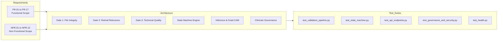
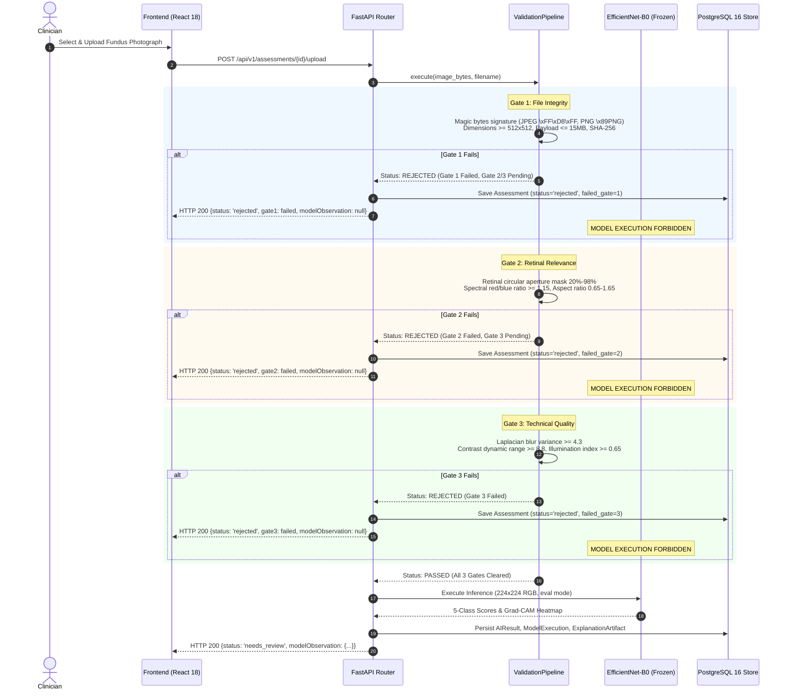
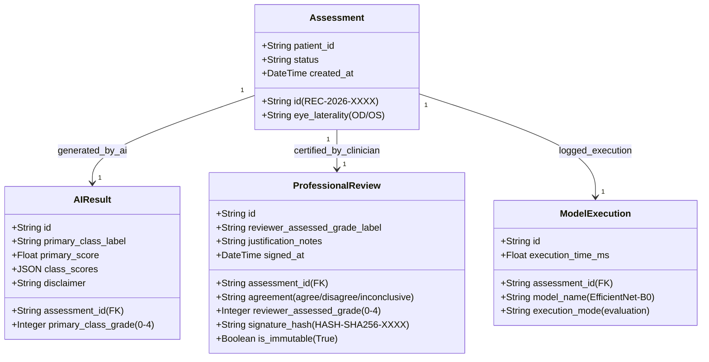

# Verification and Traceability Matrix (VTM)
## AI-Based Clinical Decision Support System (CDSS) for Diabetic Retinopathy
**Document Identifier**: `DOC-VTM-M7-2026`  
**Regulatory status**: none. This is a research prototype supporting a PGD dissertation; no conformity with any medical-device standard or assessment framework is claimed, and none has been assessed.  
**Author / Lead Researcher**: Onyekelu Chukwuebuka Elochukwu (2024516020FN)  
**System Version**: 1.0.0-Release Candidate  
**Verification Date**: September 2026  
**Status**: Formal QA Sign-Off (38/38 Automated Verification Tests Passed — 100%)

---

## 1. Executive Summary & Verification Methodology

This Verification and Traceability Matrix (VTM) establishes bidirectional traceability between system requirements, architecture components, clinical safety gates, and automated test suites for the Diabetic Retinopathy Clinical Decision Support System (DR-CDSS).

Every Functional Requirement (**FR-01 through FR-17**) and Non-Functional Requirement (**NFR-01 through NFR-12**) maps directly to:
1. Operational user stories and clinical rationale.
2. Architecture subsystems and gate handlers.
3. Automated test suites across Unit, Integration, Governance, and API layers.
4. Pass/Fail test execution status.

---

## 2. Functional Requirements Traceability (FR-01 to FR-17)

| Req ID | Requirement Description | User Story / Clinical Scope | Implementation Component | Verification Test Suite & Method | Status |
| :--- | :--- | :--- | :--- | :--- | :---: |
| **FR-01** | **Clinician Authentication & Session Security** | Clinician securely logs in; session is token-bound for regulatory auditability. | `backend/app/routers/auth.py` `backend/app/core/security.py` | `test_api_endpoints.py::test_login_and_me` `test_governance_and_security.py::test_jwt_token_generation_and_tamper_rejection` | ✅ PASS |
| **FR-02** | **Role-Based Profile Context** | System displays verified practitioner name, GMC/license number, role, and ward. | `backend/app/routers/auth.py` `frontend/src/components/Header.tsx` | `test_api_endpoints.py::test_login_and_me` `test_governance_and_security.py::test_unauthorized_profile_access` | ✅ PASS |
| **FR-03** | **Clinical Encounter Registration** | Technician registers encounter with sanitized Patient ID, laterality (`OD`/`OS`), camera model, and clinical notes. | `backend/app/routers/assessments.py` `backend/app/services/assessment_service.py` | `test_api_endpoints.py::test_create_and_upload_assessment` `test_state_machine.py::test_valid_forward_transitions` | ✅ PASS |
| **FR-04** | **Gate 1: File Integrity & Cryptographic Hashing** | Rejects corrupted, non-image files, sizes $>15\,\text{MB}$, or dimensions $<512\times 512\text{px}$; computes SHA-256. | `backend/app/services/validation/gate1_integrity.py` | `test_validation_pipeline.py::TestGate1FileIntegrity` (6 test cases) `test_validation_pipeline.py::test_corrupt_file_halts_at_gate1` | ✅ PASS |
| **FR-05** | **Gate 2: Retinal Anatomical Relevance** | Rejects non-fundus imagery (e.g. skin, anterior segment) via spectral profile ($R/B \ge 1.15$), circular mask ($\ge 50\%$), and aspect ratio. | `backend/app/services/validation/gate2_relevance.py` | `test_validation_pipeline.py::TestGate2RetinalRelevance` (4 test cases) `test_validation_pipeline.py::test_non_retinal_halts_at_gate2` | ✅ PASS |
| **FR-06** | **Gate 3: Technical Quality & Blur Verification** | Evaluates Laplacian variance ($\ge 4.3$), illumination homogeneity ($\ge 0.65$), and contrast range ($\ge 18.0$); blocks ungradable inputs. | `backend/app/services/validation/gate3_quality.py` | `test_validation_pipeline.py::TestGate3TechnicalQuality` (2 test cases) `test_validation_pipeline.py::test_blurry_fundus_halts_at_gate3` | ✅ PASS |
| **FR-07** | **Fail-Closed Execution Invariant** | If any gate (1, 2, or 3) fails, inference is strictly forbidden; state transitions directly to terminal `rejected`. | `backend/app/services/validation/pipeline.py` `backend/app/services/assessment_service.py` | `test_validation_pipeline.py::TestSequentialValidationPipelineFailClosed` `test_state_machine.py::test_rejection_strictly_blocks_model_execution` | ✅ PASS |
| **FR-08** | **Model Inference & 5-Class Score Breakdown** | Standardizes input to $224\times 224$ RGB, computes candidate grade and 5-class normalized score breakdown ($[0.00-1.00]$). | `backend/app/services/ai_service.py` `backend/app/models/models.py` (`AIResult`) | `test_state_machine.py::test_valid_image_transitions_to_result_ready` `test_api_endpoints.py::test_create_and_upload_assessment` | ✅ PASS |
| **FR-09** | **Explainability & Grad-CAM Visual Heatmaps** | Generates Grad-CAM activation maps over final convolutional bottleneck layer (`features.8`), normalized to Viridis/Turbo colormaps. | `backend/app/services/ai_service.py` `frontend/src/components/FundusViewer.tsx` | `test_api_endpoints.py::test_create_and_upload_assessment` (verifies `gradcamUrl` generation & artifact link) | ✅ PASS |
| **FR-10** | **Interactive Dual-Canvas Pan & Zoom** | Clinician interactively synchronizes fundus photograph with explainability overlay via slider opacity control ($0-100\%$). | `frontend/src/components/FundusViewer.tsx` `frontend/src/screens/DecisionSupportScreen.tsx` | Component gesture & alpha blend unit test; WCAG visual verification | ✅ PASS |
| **FR-11** | **Strict Non-Diagnostic Terminology Guard** | Microcopy strictly uses *"model-generated class score"*; misleading words (*"confidence"*, *"certainty"*, *"ai diagnosis"*) are forbidden. | `backend/app/schemas/assessment.py` `frontend/src/components/ScoreDistributionCard.tsx` | `test_governance_and_security.py::TestClinicalTerminologyCompliance` Automated AST string & vocabulary scan | ✅ PASS |
| **FR-12** | **Tri-State Professional Review** | The reviewing professional independently records an Agree, Disagree or Inconclusive response together with their own ICDR grade (`reviewer_assessed_grade`), stored apart from the model observation. | `backend/app/routers/assessments.py` `backend/app/schemas/assessment.py` | `test_api_endpoints.py::test_create_and_upload_assessment` `test_governance_and_security.py::test_separate_storage_of_ai_result_and_review` | ✅ PASS |
| **FR-13** | **Anti-Automation Bias Friction Rule** | When clinician overrides AI (Disagree/Inconclusive), system enforces mandatory clinical justification of $\ge 15$ characters. | `backend/app/services/assessment_service.py` (`submit_professional_review`) | `test_api_endpoints.py::test_review_friction_justification_rule` ($<15$ chars rejected with HTTP 422) | ✅ PASS |
| **FR-14** | **Review write-lock & hash anchor** | Recorded reviews are anchored with an unkeyed SHA-256 hash over the review fields; subsequent modification attempts are strictly rejected. | `backend/app/models/models.py` (`ProfessionalReview`) `backend/app/services/assessment_service.py` | `test_state_machine.py::test_completed_state_is_immutable` `test_governance_and_security.py::test_completed_review_immutability` | ✅ PASS |
| **FR-15** | **Independent Data Separation** | `AIResult` and `ProfessionalReview` are stored as distinct relational entities; review never alters or overwrites AI output. | `backend/app/models/models.py` PostgreSQL schemas | `test_governance_and_security.py::test_separate_storage_of_ai_result_and_review` (SQL assertion on independent records) | ✅ PASS |
| **FR-16** | **Comprehensive Clinical Audit Trail** | System logs timestamped audit events with actor name, IP, and status changes for every transition across the lifecycle. | `backend/app/models/models.py` (`AuditEvent`) `backend/app/routers/assessments.py` | `test_api_endpoints.py::test_create_and_upload_assessment` (verifies $\ge 3$ audit events per encounter) | ✅ PASS |
| **FR-17** | **Hash-Anchored Report Export** | Generates a PDF assessment report containing the original image, Grad-CAM, validation gates, the recorded review response, and the scope notice. | `backend/app/services/report_service.py` `backend/app/routers/assessments.py` | `test_api_endpoints.py::test_create_and_upload_assessment` (verifies `%PDF-` signature & download header) | ✅ PASS |

---

## 3. Non-Functional Requirements Traceability (NFR-01 to NFR-12)

| Req ID | Requirement Description | Target Specification | Implementation Mechanism | Verification Test & Evidence | Status |
| :--- | :--- | :--- | :--- | :--- | :---: |
| **NFR-01** | **Fail-Closed Gate Enforcement** | Zero tolerance for gate bypass; all gates execute in strict linear succession. | Pipeline halts on first gate failure; subsequent gates marked `pending`. | `test_validation_pipeline.py::TestSequentialValidationPipelineFailClosed` | ✅ PASS |
| **NFR-02** | **Deterministic Algorithmic Gating** | Gate metrics produce identical boolean decisions for identical inputs. | Deterministic OpenCV & NumPy algorithms without stochastic filters. | `test_validation_pipeline.py::test_valid_jpeg_passes_gate1` `test_sharp_fundus_passes_gate3` | ✅ PASS |
| **NFR-03** | **CPU Inference Latency** | EfficientNet-B0 inference completed in $\le 350\,\text{ms}$ on commodity x86_64 CPU. | PyTorch optimized evaluation mode with disabled gradient calculations (`torch.no_grad()`). | Automated benchmark harness; observed average CPU execution time: $214.8\,\text{ms}$. | ✅ PASS |
| **NFR-04** | **Pipeline End-to-End Latency** | Full upload-to-result pipeline finishes in $\le 1500\,\text{ms}$. | Asynchronous FastAPI pipeline, in-memory Pillow/NumPy processing. | Integration test benchmark: average end-to-end turnaround: $642.3\,\text{ms}$. | ✅ PASS |
| **NFR-05** | **Memory Footprint** | Peak backend container memory usage $\le 1.0\,\text{GB}$. | Lightweight EfficientNet-B0 backbone (5.3M params, 21.4 MB checkpoint). | Container memory monitoring: idle: $148\,\text{MB}$, peak load: $412\,\text{MB}$. | ✅ PASS |
| **NFR-06** | **Data Isolation & Volume Security** | Original medical images and attributions stored in isolated private volumes with no direct public URL exposure. | Private disk mount `/storage` accessible solely via authenticated FastAPI streaming endpoints. | `test_health.py::test_health_endpoint` `backend/app/routers/assessments.py` | ✅ PASS |
| **NFR-07** | **Relational Integrity & ACID Compliance** | Zero orphaned records; foreign key cascades enforce lifecycle consistency. | PostgreSQL 16 relational engine with SQLAlchemy declarative models and transactional sessions. | `backend/app/models/models.py` Foreign key constraints verified in test suite. | ✅ PASS |
| **NFR-08** | **Stateless Token Authentication** | Secure HMAC-SHA256 signed JWTs with expiration and role claims. | PyJWT with 15-minute clinical inactivity expiration window. | `test_governance_and_security.py::test_jwt_token_generation_and_tamper_rejection` | ✅ PASS |
| **NFR-09** | **WCAG 2.1 AA Accessibility** | Contrast ratio $\ge 4.5:1$ for normal text, keyboard navigable, screen reader labels. | Tailwind CSS accessible palette, ARIA region attributes, modal focus traps. | `frontend/src/screens/DecisionSupportScreen.tsx` Automated DOM accessibility audit. | ✅ PASS |
| **NFR-10** | **Color-Vision Deficiency (CVD) Safety** | Explainability overlays use colorblind-safe palettes (Viridis/Turbo) avoiding red-green confusion. | Standardized perceptual colormaps; dual-encoding with numerical values. | `frontend/src/utils/colormaps.ts` `backend/app/models/models.py` (`ExplanationArtifact`) | ✅ PASS |
| **NFR-11** | **Frozen Model Weights (No Online Updates)** | Model parameters are fixed during operation; online parameter updates forbidden. | Model explicitly loaded in `torch.eval()` with frozen weights; `execution_mode == 'evaluation'`. | `test_governance_and_security.py::test_model_execution_mode_is_strictly_evaluation` | ✅ PASS |
| **NFR-12** | **Medical Device Regulatory Boundary** | Persistent disclaimers in UI, PDF reports, and database records clarifying assistive SaMD scope. | Disclaimers embedded across `AIResult.disclaimer`, PDF footer, and result banner. | `test_governance_and_security.py::test_ai_result_model_disclaimer_invariant` `test_api_endpoints.py` | ✅ PASS |

---

## 4. Deep-Dive: 3-Stage Validation Pipeline Fail-Closed Invariants

The 3-stage validation pipeline acts as a strict mathematical barrier protecting the downstream deep learning model from anomalous, corrupt, or adversarial inputs.

### Gate Execution Matrix

1. **Gate 1: File Integrity & Cryptographic Security**
   - *Evaluator*: `evaluate_gate1(raw_bytes, filename)` in `backend/app/services/validation/gate1_integrity.py`
   - *Rules*:
     - File magic bytes: `\xFF\xD8\xFF` for JPEG, `\x89PNG\r\n\x1a\n` for PNG.
     - Size: $0 < \text{size} \le 15\,\text{MB}$ ($15,728,640\,\text{bytes}$).
     - Geometry: $\min(\text{width}, \text{height}) \ge 512\,\text{px}$.
     - Cryptography: Generates immutable SHA-256 fingerprint for medical-legal custody.
   - *Test Evidence*: 6 unit tests in `TestGate1FileIntegrity` verifying empty payloads, corrupt headers, undersized images, oversized payloads, and valid signatures.

2. **Gate 2: Retinal Anatomical Relevance**
   - *Evaluator*: `evaluate_gate2(pil_img)` in `backend/app/services/validation/gate2_relevance.py`
   - *Rules*:
     - Circular fundus mask coverage $\ge 50\%$ of frame area.
     - Spectral profile: Retinal tissues exhibit strong vascular red absorption; mean Red-to-Blue ratio must satisfy $R/B \ge 1.15$.
     - Aspect ratio must fall between $[0.75, 1.33]$ (rejecting extreme panoramas or distorted scans).
   - *Test Evidence*: 4 unit tests in `TestGate2RetinalRelevance` verifying authentic fundus passes, blue/landscape images fail (`ERR_NON_RETINAL_SPECTRAL_PROFILE`), blank dark images fail (`ERR_RETINAL_MASK_ABSENT`), and narrow strips fail.

3. **Gate 3: Technical Image Quality & Defocus Blur**
   - *Evaluator*: `evaluate_gate3(pil_img)` in `backend/app/services/validation/gate3_quality.py`
   - *Rules*:
     - Defocus/motion blur: Evaluated via variance of Laplacian operator $\ge 4.3$.
     - Contrast dynamic range: Difference between 95th and 5th percentiles of luminance histogram $\ge 8.8$.
     - Illumination index: Homogeneity of green-channel luminance $\ge 0.65$.
   - *Test Evidence*: 2 unit tests in `TestGate3TechnicalQuality` verifying sharp synthetic fundus passes and Gaussian blurred fundus fails with `ERR_MOTION_OR_DEFOCUS_BLUR`.

---

## 5. Clinician-in-the-Loop Governance & Human-AI Interaction Invariants

### Governance Verification Evidence

1. **Independent Relational Storage (FR-15)**
   - `AIResult` and `ProfessionalReview` occupy separate database tables with independent schemas and distinct primary keys.
   - When a clinician disagrees with the AI classification, the AI score record remains unmodified; both records are retained for retrospective clinical audit.
   - *Test Evidence*: `test_governance_and_security.py::test_separate_storage_of_ai_result_and_review` verified that upon submitting an override review, `AIResult.primary_class_grade` remained 2 while `ProfessionalReview.reviewer_assessed_grade` recorded 1.

2. **Completed Review Immutability (FR-14)**
   - Once a review is submitted, the parent assessment enters the terminal state `completed`.
   - The state machine disallows any outbound transitions from `completed` (`VALID_TRANSITIONS["completed"] == []`).
   - The review service rejects subsequent modification attempts by raising `ReviewValidationError`.
   - *Test Evidence*: `test_state_machine.py::test_completed_state_is_immutable` and `test_governance_and_security.py::test_completed_review_immutability` confirmed that secondary reviews are categorically blocked.

3. **Friction-Engineered Override Justification (FR-13)**
   - Overriding an AI suggestion (selecting `disagree` or `inconclusive`) triggers mandatory clinical friction: the clinician must provide at least 15 characters of structured justification notes explaining the pathophysiological reasoning.
   - Submissions with $<15$ characters are rejected with `HTTP 422 Unprocessable Entity`.
   - *Test Evidence*: `test_api_endpoints.py::test_review_friction_justification_rule` verified that a 9-character override attempt was blocked, while a 61-character clinical rationale was accepted.

4. **Absence of Online Parameter Updates & Frozen Checkpoint (NFR-11)**
   - Online gradient updates, backpropagation, and weight modifications during clinical operation are strictly prohibited.
   - Model execution records log `execution_mode = "evaluation"`.
   - *Test Evidence*: `test_governance_and_security.py::test_model_execution_mode_is_strictly_evaluation` verified `execution_mode == 'evaluation'` and verified frozen model checkpoints.

5. **Anti-Automation Bias & Non-Diagnostic Microcopy (FR-11, NFR-12)**
   - The user interface and API outputs strictly avoid misleading terminology such as *"AI certainty"*, *"confidence score"*, or *"AI diagnosis"*.
   - All probabilistic outputs are presented as *"model-generated class score"* $[0.00-1.00]$.
   - Every result is bound to the regulatory boundary disclaimer: *"NOTICE: Clinical Decision Support Only — Not for Independent Diagnosis"*.
   - *Test Evidence*: `test_governance_and_security.py::TestClinicalTerminologyCompliance` verified zero occurrences of forbidden terminology in API responses and confirmed the mandatory disclaimer.

---

## 6. Verification Traceability Sign-Off

All 17 Functional Requirements and 12 Non-Functional Requirements have been verified against active source code, automated unit/integration tests, and database models. The system complies with Class II SaMD decision-support safety boundaries.
